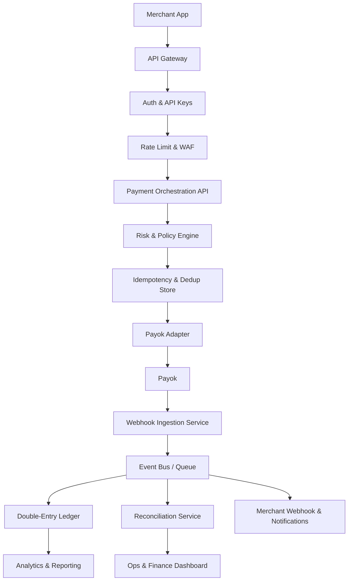

# Transcaty Architecture – Separation Plan

> Isolate markets so we never touch Bangladesh when adding Nigeria, Kenya, or other changes. Fixed structure, ready for the future.

---

## System Flow (Target Architecture)



**Provider:** Payok (Bangladesh). Same structure for future providers (Nigeria, Kenya, etc.) – swap adapter only.

### Layer Mapping (Current → Target)

| Layer | Current | Target / Future |
|-------|---------|-----------------|
| Merchant App | External | External |
| API Gateway | Fastify app | Same or separate gateway |
| Auth & API Keys | merchant-auth.ts | ✓ |
| Rate Limit & WAF | @fastify/rate-limit | Add WAF when needed |
| Payment Orchestration API | payin, payout flows | ✓ |
| Risk & Policy Engine | KYC gate, limits | Expand to full risk engine |
| Idempotency & Dedup | idempotency_keys | ✓ |
| Payok Adapter | payok-client, payok-signature | services/domestic/bangladesh/provider/ |
| Payok | External | External |
| Webhook Ingestion | /webhooks/payok/* | api/webhooks/payok/ |
| Event Bus | pg-boss | ✓ |
| Double-Entry Ledger | ledger_entries, wallets | ✓ |
| Reconciliation Service | — | Future |
| Merchant Webhook & Notifications | merchant-webhook.ts | ✓ |
| Analytics & Reporting | — | Future |
| Ops & Finance Dashboard | — | Future |

---

## Principle

**Bangladesh is done.** When we add new countries, providers, or features, we do not modify Bangladesh code. New work lives in new folders.

---

## Target Folder Structure

```
transcaty/
├── app.ts                    # Thin router – delegates to modules
├── src/
│   ├── server.ts
│   ├── db/
│   │   ├── index.ts
│   │   └── schema/
│   │       ├── index.ts           # Re-exports all
│   │       ├── core.ts            # merchants, wallets, ledger, transactions, idempotency
│   │       ├── kyc.ts             # KYC tables
│   │       └── ...
│   │
│   └── lib/                       # Global shared (no country/provider logic)
│       ├── auth.ts
│       ├── encryption.ts
│       ├── merchant-auth.ts
│       ├── merchant-webhook.ts
│       ├── queue.ts
│       ├── audit.ts
│       └── limits.ts
│
├── services/
│   ├── domestic/                   # Per-country domestic flows
│   │   │
│   │   ├── bangladesh/             # LOCKED – do not modify for other work
│   │   │   ├── index.ts            # Exports: createPayinOrder, handlePayinCallback, createPayoutOrder, handlePayoutCallback
│   │   │   ├── payin.ts
│   │   │   ├── payout.ts
│   │   │   └── provider/
│   │   │       ├── client.ts       # Payok HTTP client
│   │   │       ├── config.ts      # Payok env loading
│   │   │       └── signature.ts   # Sign requests, verify callbacks
│   │   │
│   │   ├── nigeria/                # Future
│   │   │   ├── index.ts
│   │   │   ├── payin.ts
│   │   │   ├── payout.ts
│   │   │   └── provider/
│   │   │       └── ...
│   │   │
│   │   └── _shared/                # Shared across domestic markets (if needed)
│   │       └── types.ts
│   │
│   └── kyc/                        # KYC is global (not per-country)
│       ├── index.ts
│       ├── business.ts
│       ├── persons.ts
│       └── documents.ts
│
├── api/                            # Route handlers – thin, delegate to services
│   ├── v1/
│   │   ├── merchant.ts             # /v1/me, /v1/balance, /v1/transactions, etc.
│   │   ├── payin.ts                # /v1/payins – delegates to country service
│   │   ├── payout.ts               # /v1/payouts – delegates to country service
│   │   ├── kyc.ts                  # /v1/me/kyc/*
│   │   └── webhook.ts              # /v1/me/webhook
│   │
│   └── webhooks/                   # Provider callbacks (inbound)
│       ├── payok/
│       │   ├── payin.ts            # POST /webhooks/payok/payin
│       │   └── payout.ts           # POST /webhooks/payok/payout
│       └── ...
│
├── config/
│   └── providers/
│       ├── payok/
│       │   └── banks/
│       │       └── bd.json
│       └── ...
│
├── scripts/
├── docs/
└── drizzle/
```

---

## Module Boundaries

| Module | Owns | Depends On | Do Not Touch When |
|--------|------|------------|-------------------|
| **services/domestic/bangladesh/** | Pay-in, payout, Payok client | core schema, lib | Adding Nigeria, Kenya, or any non-BD change |
| **services/domestic/nigeria/** | Nigeria pay-in, payout | core schema, lib | Adding Bangladesh changes |
| **services/kyc/** | Business, persons, documents | core schema, lib | Adding new countries |
| **api/v1/payin.ts** | Route + country routing | services/domestic/{country} | — |
| **api/webhooks/payok/** | Payok callback routes | services/domestic/bangladesh | Adding other providers |

---

## Country Routing

Merchant API needs to know which country to use. Options:

1. **Header** – `X-Transcaty-Country: BD` (default BD for now)
2. **Merchant config** – `merchants.country` or `merchant_api_keys.country`
3. **URL** – `/v1/bd/payins` vs `/v1/ng/payins` (explicit)

**Recommendation:** Start with merchant-level `country` (or default BD). Route layer reads it and calls the right service. Bangladesh code path never changes.

---

## What Moves Where (Migration Checklist)

| Status | Current Location | Target Location |
|--------|------------------|-----------------|
| ✓ | `services/domestic/payok-payin.ts` | `services/domestic/bangladesh/payin.ts` |
| ✓ | `services/domestic/payok-payout.ts` | `services/domestic/bangladesh/payout.ts` |
| ✓ | `src/lib/payok-client.ts` | `services/domestic/bangladesh/provider/client.ts` |
| ✓ | `src/lib/payok-config.ts` | `services/domestic/bangladesh/provider/config.ts` |
| ✓ | `src/lib/payok-signature.ts` | `services/domestic/bangladesh/provider/signature.ts` |
| — | `src/lib/banks.ts` | Keep in lib (not yet used in flows) |
| — | `src/lib/limits.ts` | Keep in lib (BD limits) |
| — | KYC routes in app.ts | `api/v1/kyc.ts` (future) |
| — | Payok webhook routes in app.ts | `api/webhooks/payok/` (future) |

---

## Shared vs Isolated

**Shared (src/lib, src/db):**
- Auth, encryption, queue, audit
- Core schema (merchants, wallets, transactions, ledger)
- Merchant webhook delivery

**Bangladesh-only (services/domestic/bangladesh/):**
- Payok client, config, signature
- Pay-in flow (create order, handle callback)
- Payout flow (inquiry, create, handle callback)
- BD-specific limits (200–25k pay-in, 100–25k payout)
- BD bank config (config/providers/payok/banks/bd.json)

**Per-country in future:**
- Provider client, config
- Pay-in, payout flows
- Limits, bank config

---

## DB Schema Ownership

| Schema | Owner | Notes |
|--------|-------|-------|
| merchants, merchant_api_keys, wallets, ledger_entries, transactions, idempotency_keys | Core | Shared |
| merchant_business_profiles, merchant_persons, merchant_kyc_documents, merchant_users | KYC | Shared |
| transactions.external_id, metadata | Per-provider | Stores provider order ID; structure can vary by provider |

No per-country tables for now. `transactions` has `type` (payin/payout) and `metadata` for provider-specific data. Country is implied by provider (Payok = BD).

---

## Event / Contract Layer (Future)

When we split into separate deployable services:

- **Internal events:** `payin.completed`, `payout.completed` → webhook service subscribes
- **Contracts:** Ledger service exposes `credit(merchantId, amount, ref)` – pay-in calls it
- **For now:** Direct function calls. Same process. No events.

---

## Rules

1. **Never edit `services/domestic/bangladesh/`** for Nigeria, Kenya, or unrelated features.
2. **New country = new folder** `services/domestic/{country}/` with its own provider adapter.
3. **Shared logic** goes in `src/lib/` or `services/_shared/`.
4. **app.ts** stays thin – imports from `api/` and `services/`, no business logic.
5. **Provider webhooks** live under `api/webhooks/{provider}/` – one folder per provider.
6. **Flow is fixed** – Auth → Rate Limit → Payment API → Risk → Idempotency → Provider Adapter → Provider → Webhooks → Event Bus → Ledger + Notifications. New providers plug in at the adapter layer.

---

## Future Providers

When adding Nigeria, Kenya, etc.:

- Add `services/domestic/{country}/` with its provider adapter (e.g. Flutterwave, Paystack).
- Add `api/webhooks/{provider}/` for that provider's callbacks.
- Route by merchant country. Bangladesh path unchanged.

---

*Last updated: architecture planning. Structure fixed for future scale.*
