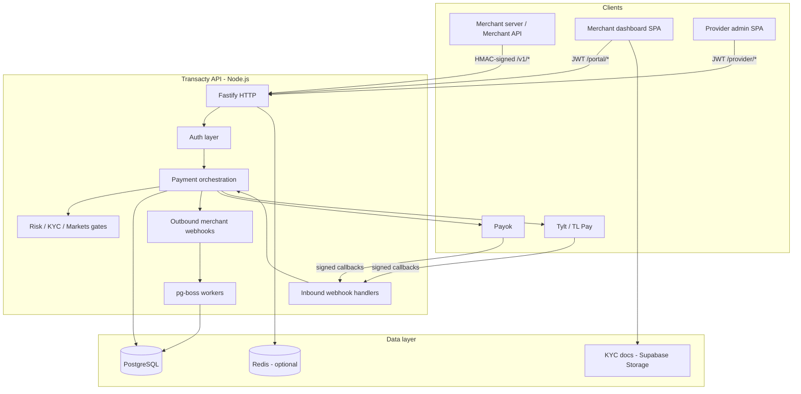

# Transacty — CTO Technical Overview

> **Purpose:** A single briefing document for explaining what we have built, how the system works, and which technologies and patterns we rely on. Use this when a CTO, investor technical advisor, or senior engineer asks “walk me through the platform.”
>
> **Audience:** Technical leadership. Assumes familiarity with payments, APIs, and Postgres — not our codebase.
>
> **Scope:** Backend API in this repository. Merchant portal and provider admin dashboards are separate SPAs (hosted on Vercel / `*.transacty.ai`) that call `/portal/*` and `/provider/*`.

---

## 1. What we built (30-second pitch)

**Transacty** is a B2B payment orchestration platform. Merchants integrate once and can:

- Collect and send money in **Bangladesh (BDT)** via **Payok**
- Collect and send money in **India** (UPI, crypto rails) via **TL Pay (Tylt)**
- Collect and send money in **Europe** (Open Banking) via **Tylt**
- Manage **multi-currency wallets**, **customer sub-wallets**, **KYC**, **pricing/fees**, and **outbound webhooks**

We are the **system of record** for merchant balances, transaction state, and audit trails. External processors (Payok, Tylt) are adapters — we never trust a callback without signature verification and idempotent state transitions.

---

## 2. High-level architecture



**Deployment today:** One Node process on **Render** runs the HTTP server **and** background workers (email, merchant webhooks, monthly billing). Postgres is the source of truth; Redis is optional but recommended for distributed rate limits across instances.

---

## 3. Technology stack

| Layer | Choice | Why |
|-------|--------|-----|
| Runtime | **Node.js 20+** (ES modules) | Team velocity, strong async I/O for webhooks and provider HTTP |
| Language | **TypeScript** | Type safety on money paths and API contracts |
| HTTP | **Fastify 5** | Performance, schema validation, plugin ecosystem |
| Validation | **Zod** + `fastify-type-provider-zod` | Request/response contracts at the edge |
| Database | **PostgreSQL** | ACID, row locking, JSON metadata, mature ops story |
| ORM | **Drizzle** | SQL-first, parameterized queries, migrations in repo |
| Job queue | **pg-boss** | Same Postgres as app — no extra broker to operate in v1 |
| Cache | **Redis** (`ioredis`) | Distributed rate limits; health check includes Redis when configured |
| Email | ZeptoMail / Resend / SMTP | Transactional email (password reset, alerts) |
| KYC files | **Supabase Storage** | Private bucket, signed upload/download URLs |
| Secrets | AES-256-GCM + env | `*_ENC` encrypted env vars decrypted with `ENCRYPTION_MASTER_KEY` |
| Metrics | **Prometheus** (`prom-client`) | HTTP latency/counts; gated by `METRICS_TOKEN` in production |
| CI | GitHub Actions | Build, unit tests, SQL safety scan, advisory dependency audit |

We deliberately avoided a microservices split in v1: **one deployable API** with clear **folder boundaries** so we can extract workers or rails later without rewriting money logic.

---

## 4. Repository structure (how code is organized)

```
transacty/
├── app.ts                 # Main Fastify app: /v1 merchant API, inbound webhooks, global middleware
├── src/
│   ├── server.ts          # Process entry: starts queue workers, graceful shutdown
│   ├── db/                # Drizzle schema + connection pool
│   └── lib/               # Shared domain logic (auth, money, billing, fraud, queue, …)
├── api/
│   ├── portal/            # Merchant dashboard API (/portal/*)
│   └── provider/          # Internal ops API (/provider/*)
├── services/
│   ├── domestic/bangladesh/   # Payok BDT pay-in / pay-out (isolated)
│   ├── integrations/tylt/     # India + Europe Tylt products
│   └── operations/            # Internal BDT customer wallet transfers/refunds
├── drizzle/               # Versioned SQL migrations
├── tests/                 # Unit + integration tests
└── docs/                  # Deep-dive specs (this file indexes them)
```

### Design principle: market isolation

**Bangladesh lives in `services/domestic/bangladesh/`** and is treated as stable. New countries or processors get **new folders**, not edits to Bangladesh. India and Europe currently share the Tylt integration package under `services/integrations/tylt/` with separate config lanes (`TYLT_*_INDIA_*`, `TYLT_*_EUR_*`).

### Current vs target

| Area | Today | Target (documented in `ARCHITECTURE.md`) |
|------|-------|------------------------------------------|
| Merchant `/v1/*` routes | Mostly in `app.ts` | Thin `api/v1/` routers delegating to services |
| Inbound webhooks | In `app.ts` | `api/webhooks/` modules |
| Workers | In-process with HTTP | Optional dedicated Render worker service |

This is an honest tradeoff: we optimized for **shipping rails and money safety** before finishing route modularization.

---

## 5. Three surfaces, three auth models

We expose three distinct APIs. A CTO should understand that **they are intentionally separated** — compromise of one surface does not automatically grant access to another.

### 5.1 Merchant API (`/v1/*`) — server-to-server

**Who:** Merchant backends integrating pay-in, pay-out, balance, transfers.

**Auth:** Per-merchant API keys with **HMAC-SHA256 request signing**.

- Headers: `X-Transacty-Key`, `X-Transacty-Signature`, `X-Transacty-Timestamp`
- Replay protection: ±5 minute timestamp window
- Keys stored hashed; secrets encrypted at rest
- Scopes: `payin:create`, `payout:create`, `balance:read`, `wallets:create`, `transfer:create`, `internal_transfer:create`, etc.
- **Test vs live:** separate keys and wallet environments

**Code:** `src/lib/merchant-auth.ts`, `merchant_api_keys` table.

### 5.2 Merchant portal (`/portal/*`) — humans at the merchant

**Who:** Merchant staff using the dashboard SPA.

**Auth:** Email/password → **JWT** (7-day session), optional **TOTP MFA**.

- Business signup creates merchant + first admin user
- KYC submission, API key management, transaction history, wallet views
- JWT hardening: `iss`, `aud`, `jti`, revocation on logout (`jwt_revocations`)

**Code:** `api/portal/*`, `src/lib/portal-auth.ts`.

### 5.3 Provider admin (`/provider/*`) — Transacty internal ops

**Who:** Transacty operators (super_admin, ops, risk, finance, support).

**Auth:** Email/password → **JWT** + MFA; optional bootstrap **API key** for break-glass (downgraded permissions).

- Role-based permission matrix (read vs write per domain)
- **Step-up MFA** for money mutations (wallet adjust, transaction status override)
- **Maker-checker:** high-risk actions queue for a second approver
- API keys **cannot** perform money mutations even if role would allow

**Code:** `api/provider/*`, `src/lib/provider-auth.ts`. See `AUTH_HARDENING.md`.

---

## 6. Money: wallets, ledger, and invariants

This is what a CTO will probe hardest. Our answer: **we treat money as a database transaction problem, not a floating-point problem.**

### 6.1 Data model

| Entity | Role |
|--------|------|
| `merchants` | Tenant root; status, KYC, webhook URL |
| `wallets` | Balance holder — `merchant` or `customer` type; `test` / `live` environment; multi-currency (BDT, INR, USDT, USDC, …) |
| `ledger_entries` | Append-only debit/credit lines per wallet (immutable via DB trigger) |
| `transactions` | Pay-in, pay-out, transfer, refund — state machine: `pending` → `success` \| `failed` |

Balances are denormalized on `wallets.balance` for fast reads; ledger is the audit trail.

### 6.2 Three invariants (non-negotiable)

Documented in `MONEY_INVARIANTS.md`:

1. **Conditional status transition** — `UPDATE … WHERE status = 'pending'` so duplicate webhooks cannot double-credit.
2. **Row locks** — `SELECT … FOR UPDATE` on every wallet touched inside a money transaction; deterministic lock ordering when two wallets move.
3. **Decimal-safe math** — all arithmetic via `src/lib/money.ts` (BigInt cents), never raw JavaScript floats.

Additional rule: **no outbound HTTP inside a DB transaction** — provider calls happen between transactions so a slow Payok/Tylt response cannot hold wallet locks.

### 6.3 Fees and platform revenue

On successful pay-in/payout we can debit merchant wallets for platform fees (`src/lib/billing/fee-applier.ts`). Fees credit a **platform wallet**. Merchants have configurable pricing (`merchant_pricing`): percentage, min/max caps, optional monthly billing.

Monthly billing runs via **pg-boss cron** (1st of month).

---

## 7. Payment rails (what we integrate)

### 7.1 Bangladesh — Payok (BDT)

| | |
|--|--|
| **Products** | Domestic pay-in, pay-out |
| **Code** | `services/domestic/bangladesh/` |
| **Outbound** | RSA-signed requests to Payok |
| **Inbound** | `POST /webhooks/payok/payin`, `/payout` — signature verified on raw body |
| **Limits** | Configured in `src/lib/limits.ts` (e.g. pay-in 200–25,000 BDT) |
| **Fraud** | Velocity limits + per-merchant blacklist (phone/account/email) |

### 7.2 India — Tylt / TL Pay

| Product | Merchant API | Settlement notes |
|---------|--------------|------------------|
| H2H UPI | `/v1/h2h/*` | Payer pays INR; merchant settlement wallet is **USDT** |
| CrossRamp UPI | CrossRamp flow + webhooks | Manual settlement recovery supported |
| CPG crypto pay-in/out | `/v1/cpg/*` | Crypto rails |
| Internal transfer | `/v1/internal-transfer` | Tylt wallet-to-wallet |
| Discovery / balance | `/v1/supported/*`, `/v1/account-balance` | Ops and routing |

**Webhooks:** Multiple Tylt paths (`/webhooks/tylt/crossramp/:env`, `h2h`, `cpg-payin`, `cpg-payout`, …) with HMAC verification.

**Code:** `services/integrations/tylt/`.

### 7.3 Europe — Tylt Open Banking

| Product | Merchant API | Currency |
|---------|--------------|----------|
| EUR pay-in | `/v1/eur/payin-instances` | EUR quote → **USDC** settlement |
| EUR payout | `/v1/eur/payout-instances` (+ approve step) | USDC wallet debited |

**Code:** `eur-payin.ts`, `eur-payout.ts`, `eur-open-banking.ts`.

### 7.4 Internal (platform-native)

**BDT customer wallets:** merchants create customer wallets and transfer/refund BDT (`services/operations/transfers.ts`). This is our ledger-only product — no external processor on the transfer leg.

### 7.5 Circuit breaker

Outbound calls to Payok and Tylt go through a **per-rail circuit breaker** (`src/lib/provider-circuit-breaker.ts`). After consecutive failures we fail fast with a safe merchant-facing error instead of hammering a degraded provider.

---

## 8. Webhooks: inbound and outbound

### 8.1 Inbound (processor → Transacty)

**Flow:**

1. Capture **raw body** before JSON parse (signature verification requires exact bytes).
2. Verify signature (Payok RSA, Tylt HMAC).
3. Compute **dedupe hash** = SHA-256(`rail|environment|rawBody`).
4. **Claim** row in `webhook_events` — duplicates return 200 without re-applying (except defined manual-settlement retries for Tylt).
5. Apply business logic in service layer → update `transactions`, credit/debit wallets.
6. Mark event processed or failed.

**Why it matters:** Processors retry aggressively. Dedupe + conditional status updates make retries safe.

**Doc:** `WEBHOOK_DEDUPE_AND_IDEMPOTENCY.md`.

### 8.2 Outbound (Transacty → merchant)

When a transaction reaches a terminal state, we enqueue a **merchant webhook** job (pg-boss):

- Events: `payin.completed`, `payin.failed`, `payout.completed`, `payout.failed`
- HMAC-signed with merchant’s webhook secret
- Retries with backoff

Merchants configure URL + secret via portal (`/portal/me/webhook`). Ops can read webhook config via provider API (secret never exposed).

---

## 9. Idempotency (merchant-initiated creates)

Merchants send `Idempotency-Key` on POST creates. We store a hash of the body in `idempotency_keys` with 24h TTL:

- Same key + same body → return cached response
- Same key + different body → 409 conflict
- Prevents double pay-ins on network retries

---

## 10. Markets and multi-country entitlements

We separate **“which countries a merchant may use”** from **“which processor handles a payment.”**

| Market | Settlement currencies (wallets provisioned on approval) |
|--------|--------------------------------------------------------|
| Bangladesh | BDT |
| India | USDT (UPI settlement credits USDT; payer may pay INR fiat) |
| Europe | USDC |

**Table:** `merchant_markets` — states: `disabled` → `requested` → `kyb_in_review` → `approved` / `suspended`.

**Enforcement:** Pay-in/payout routes call `requireKycAndMarket` — merchant must be KYC-verified **and** market-approved for the rail’s region.

**Code:** `src/lib/merchant-markets.ts`. **Doc:** `PORTAL_MARKETS_WALLETS_FRONTEND.md`.

---

## 11. KYC / KYB

### Merchant KYC (global)

- Tables: business profile, persons (directors/UBOs), documents
- Portal: merchants upload via **signed Supabase URLs**
- Gate: `KYC_REQUIRED=true` blocks payment APIs until `kyc_status = verified`
- Provider admin: can review profiles/documents and approve/reject (`/provider/merchants/:id/kyc/*`)

### Per-market KYB

Provider approves each market separately; approval auto-creates test+live settlement wallets for that market’s currencies.

---

## 12. Risk, fraud, and ops controls

| Control | Scope |
|---------|--------|
| Velocity limits | BDT pay-in/payout (env-configurable) |
| Merchant blacklist | Phone, account number, email per environment |
| Provider wallet adjustments | Credit/debit with reason + reference; high amounts → maker-checker |
| Transaction status override | Ops can reconcile Payok inquiry or Tylt CrossRamp; sensitive changes need step-up + approval |
| Audit log | `merchant_audit_log` for merchant-visible history; structured stdout JSON for aggregation |

**Doc:** `FRAUD_AND_VELOCITY.md`, `AUTH_HARDENING.md`.

---

## 13. Background processing

**pg-boss** (Postgres-backed) runs inside `src/server.ts`:

| Job | Purpose |
|-----|---------|
| `merchant-webhook` | Deliver outbound webhooks with retries |
| `transactional-email` | Password reset, notifications |
| `monthly-billing` | Cron: 1st of month fee collection |

Graceful shutdown: stop HTTP → stop workers → close Redis → close DB pool (`SIGTERM`/`SIGINT`).

---

## 14. Security posture (summary for CTO)

| Topic | Approach |
|-------|----------|
| SQL injection | Drizzle parameterized queries; CI `check-sql-safety` script |
| Auth bypass | Separate auth stacks; API key downgrade for provider; JWT revocation |
| Webhook forgery | Signature verification on raw body; dedupe table |
| Secret storage | Encrypted env vars; never log secrets (Pino redact paths) |
| Rate limiting | Global + webhook + login paths; Redis when available |
| Debug endpoints | Webhook raw-body debug flags **blocked in production** |
| DB privileges | Documented least-privilege role (`SECURITY_HARDENING.md`) |
| Dependencies | Dependabot + `npm audit` in CI |

We **fail safe**: invalid signature → 401; ambiguous provider response → mark failed, don’t guess success; insufficient balance → reject payout.

---

## 15. Observability and operations

| Endpoint | Purpose |
|----------|---------|
| `GET /health` | Postgres + Redis (if configured) — Render uses this for deploy readiness |
| `GET /metrics` | Prometheus metrics; requires bearer token in production |

**Logging:** Structured JSON audit events; security events (`webhook.signature_rejected`, rate limit exceeded).

**Deploy:** Render — `npm run build`, `npm run db:migrate` on release, `npm start`. Manual promote recommended when webhook queue has backlog.

---

## 16. Testing and quality gates

| Command | What it proves |
|---------|----------------|
| `npm run validate` | TypeScript compile + SQL safety scan |
| `npm run test:unit` | Money helpers, auth, Tylt parsing, rail labels (~100+ tests) |
| `npm run test:integration` | Real Postgres: ledger immutability, pay-in callbacks, concurrency (requires `DATABASE_URL`) |

Integration tests **skip** when no database is configured — CI runs unit tests only by default.

---

## 17. What is *not* in this repository

| Component | Where |
|-----------|--------|
| Merchant dashboard UI | External SPA → `dashboard.transacty.ai` |
| Provider admin UI | External SPA → `transacty-admin.vercel.app` |
| Payok / Tylt | Third-party processors |
| Postgres / Redis | Render (or managed providers) |

The API is CORS-configured for those SPA origins plus `*.transacty.ai`.

---

## 18. How to answer common CTO questions

### “What happens if Payok sends the same webhook twice?”

We dedupe on hash of the raw body, then apply pay-in logic only if the transaction is still `pending`. A second delivery is absorbed — no double credit. See `WEBHOOK_DEDUPE_AND_IDEMPOTENCY.md`.

### “How do you prevent balance races?”

Postgres row locks inside short transactions, decimal-safe math, and no HTTP inside those transactions. Transfer tests include concurrency coverage.

### “Can an ops mistake drain a merchant?”

Wallet adjustments and status overrides require permissions, step-up MFA, and maker-checker for high-risk amounts. API-key sessions cannot mutate money.

### “How do you add a new country?”

New folder under `services/domestic/{country}/` or new Tylt lane; new `merchant_markets` entry; do not modify Bangladesh Payok code. `ARCHITECTURE.md` describes the target layout.

### “Single point of failure?”

Today: one Render web instance runs HTTP + workers. Postgres is managed; Redis optional but recommended for multi-instance rate limits. Roadmap includes dedicated worker service.

### “PCI / card data?”

We do not store card PANs. Flows are bank transfer / UPI / Open Banking / crypto settlement — scope is lower than card acquiring, but KYC docs and PII are handled with private storage and access controls.

### “How do merchants integrate?”

Server-to-server HMAC API for payments; dashboard for humans. Postman guides in `docs/POSTMAN_*`.

---

## 19. Documentation map (deeper dives)

| If they ask about… | Read |
|--------------------|------|
| Folder separation & future structure | `ARCHITECTURE.md` |
| Feature completeness & phases | `ROADMAP.md` |
| Wallet/ledger rules | `MONEY_INVARIANTS.md` |
| Webhook/idempotency | `WEBHOOK_DEDUPE_AND_IDEMPOTENCY.md` |
| Auth, MFA, step-up, API key downgrade | `AUTH_HARDENING.md` |
| Scale, Redis, circuit breaker | `HIGH_TRAFFIC_POSTURE.md` |
| Security ops checklist | `SECURITY_HARDENING.md` |
| India / EU integration | `MERCHANT_INDIA_EUR_INTEGRATION.md`, `TYLT_EUR_OPEN_BANKING.md` |
| Merchant portal API/UI | `PORTAL_FRONTEND_SPEC.md` |
| Provider admin API/UI | `PROVIDER_FRONTEND_SPEC.md`, `PROVIDER_DASHBOARD_API_UPDATE.md` |
| Markets & wallets | `PORTAL_MARKETS_WALLETS_FRONTEND.md` |
| API testing | `POSTMAN_MERCHANT_API_GUIDE.md`, `TYLT_MERCHANT_API_TESTING.md` |

---

## 20. Maturity snapshot (honest)

**Production-ready strengths**

- Multi-rail payment orchestration with signature-verified webhooks
- Money invariants enforced in code and documented
- Three-layer auth with hardened provider controls
- Multi-market entitlements, KYC, billing, fraud hooks
- Migrations, tests, CI security scans, observability hooks

**Known technical debt (acceptable for stage)**

- Large `app.ts` for merchant routes (modularization in progress)
- Workers colocated with HTTP (split planned)
- Integration tests not in default CI (need DB)
- Reconciliation is rail-specific ops tools, not a unified reconciliation product yet

---

*Last updated: June 2026. Align this document when major architecture or rail changes ship.*
