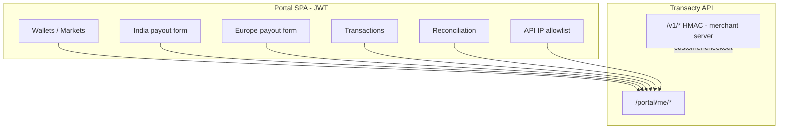
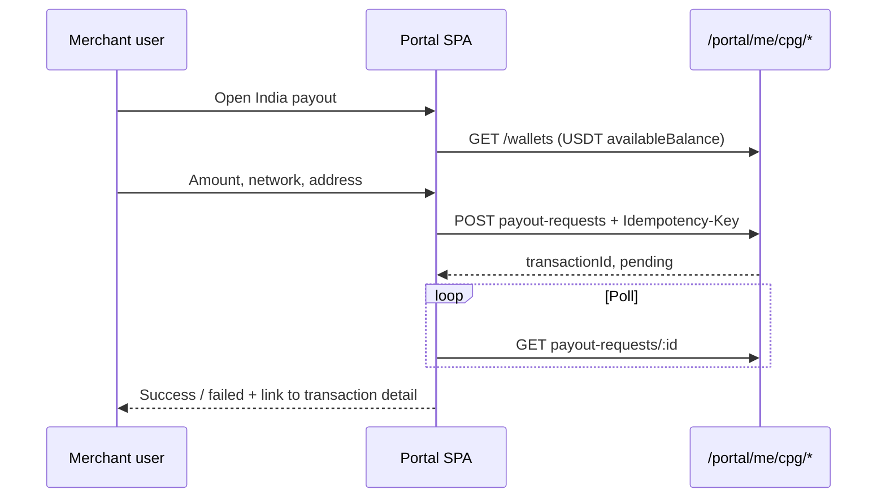
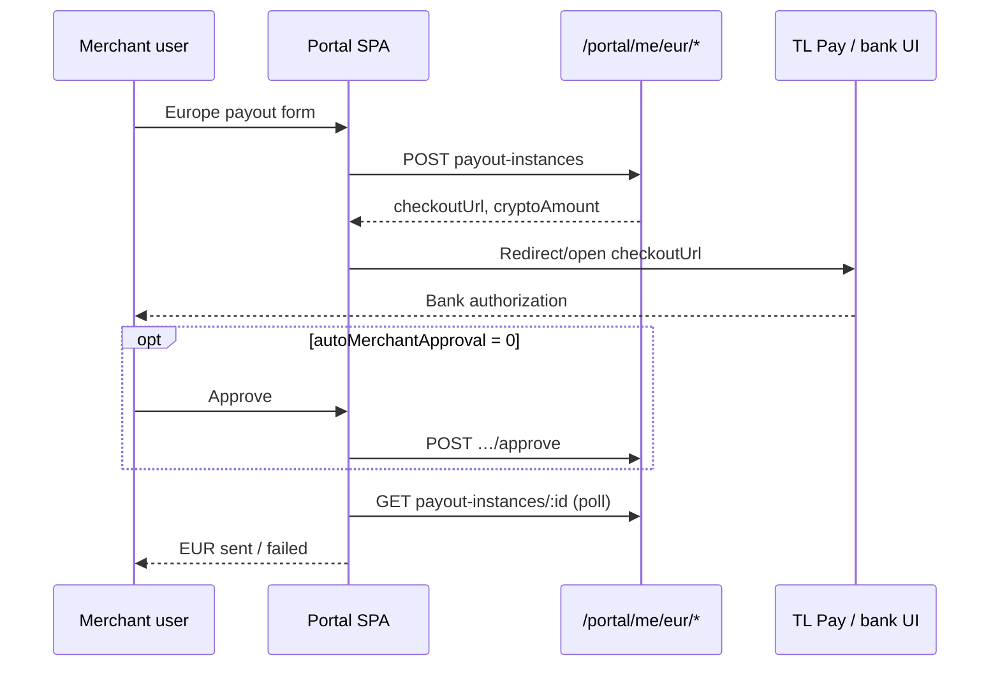

# India & Europe — Merchant Portal Frontend Spec

Implementation guide for the **merchant dashboard SPA** (JWT, `/portal/*`). Covers wallet pockets, market enablement, **India USDT payouts**, **Europe EUR payouts**, transactions, reconciliation, and API IP allowlist.

| Audience | Doc |
|----------|-----|
| **Portal frontend** (this file) | Dashboard UI, forms, polling, settings |
| **Merchant server engineers** | [MERCHANT_INDIA_EUR_INTEGRATION.md](./MERCHANT_INDIA_EUR_INTEGRATION.md) — HMAC `/v1/*` for customer checkout |
| **Baseline portal** | [PORTAL_FRONTEND_SPEC.md](./PORTAL_FRONTEND_SPEC.md) — auth, KYC, API keys, Bangladesh |
| **June 2026 extras** | [FRONTEND_HANDOFF_JUNE_2026.md](./FRONTEND_HANDOFF_JUNE_2026.md) — slug, reconciliation CSV |

---

## 1. Product model (read this first)

Merchants operate **one account** with **separate market pockets**. Do **not** sum unlike currencies into one headline balance.

| Market | Settlement wallet | Pay-in (customer → merchant) | Payout (merchant → beneficiary) |
|--------|-------------------|------------------------------|----------------------------------|
| **India** | **USDT** (ledger) | INR via UPI (`/v1/h2h/*`) or crypto CPG (`/v1/cpg/payin-*`) — **merchant server only** | USDT → on-chain address (`/portal/me/cpg/*` or `/v1/cpg/payout-*`) |
| **Europe** | **USDC** (ledger) | EUR/GBP bank → USDC (`/v1/eur/payin-*`) — **merchant server only** | USDC → EUR bank IBAN (`/portal/me/eur/*` or `/v1/eur/payout-*`) |
| **Bangladesh** | **BDT** | Portal or `/v1/payins` | Portal or `/v1/payouts` |

**Wallet address clarification (India):** Transacty provisions an **internal USDT ledger balance**, not a permanent on-chain deposit address for the merchant. CPG pay-in deposit instructions are **per transaction** from TL Pay (merchant API). CPG payout sends USDT to the **beneficiary address** the merchant supplies in `destinationDetails`.



**Portal vs merchant API**

| Action | Portal (dashboard) | Merchant API (integrator checkout) |
|--------|-------------------|-------------------------------------|
| View balances | `GET /portal/me/wallets` | `GET /v1/balance` |
| India CPG payout | `POST /portal/me/cpg/payout-requests` | `POST /v1/cpg/payout-requests` |
| Europe EUR payout | `POST /portal/me/eur/payout-instances` | `POST /v1/eur/payout-instances` |
| India UPI pay-in | **Not in portal** — link to API docs | `POST /v1/h2h/payin-instances` |
| Europe pay-in | **Not in portal** | `POST /v1/eur/payin-instances` |
| API secret / HMAC | **Never in browser** | Server-side only |

---

## 2. Global conventions

### Auth

```
Authorization: Bearer <portal_jwt>
```

Or `X-Portal-Token: <portal_jwt>`.

On `401` from `/portal/me/*`: clear session, redirect to login.

### Environment

Almost every ops endpoint accepts `environment`:

- Query: `?environment=test` | `?environment=live`
- Body: `{ "environment": "test" | "live" }` (payout creates)

Persist the user’s choice (test/live toggle) in the shell and pass it on every request.

### Idempotency (payout creates)

Send a unique header on create:

```
Idempotency-Key: <uuid>
```

Safe to retry on network failure; duplicate key returns cached `201` body within 24h.

### Fee breakdown (optional fields on create responses)

Payout create responses may include:

| Field | Meaning |
|-------|---------|
| `feeAmount` | Platform fee debited/charged |
| `feeCurrency` | Fee currency |
| `netAmount` | Amount after fee (when applicable) |
| `feeBreakdown` | Structured line items |

Show in a summary row on the confirmation step when present.

---

## 3. Implementation checklist

| Priority | Feature | Route(s) | Suggested SPA path |
|----------|---------|----------|-------------------|
| **P0** | Multi-currency wallets | `GET /portal/me/wallets` | `/dashboard` or `/wallets` |
| **P0** | Market enablement | `GET /portal/me/markets`, `POST …/markets/:market/request` | `/settings/markets` |
| **P0** | Transactions + rail filter | `GET /portal/me/transactions?rail=` | `/transactions` |
| **P0** | Reconciliation (per-currency volumes) | `GET /portal/me/reconciliation` | `/reports/reconciliation` |
| **P1** | India USDT payout | `POST/GET /portal/me/cpg/payout-requests*` | `/payouts/india` |
| **P1** | Europe EUR payout | `POST/GET /portal/me/eur/payout-instances*` | `/payouts/europe` |
| **P1** | API IP allowlist | `GET/PUT /portal/me/api-ip-rules` | `/settings/api-security` |
| **P2** | Integration help panel | Static + links | `/developers` or modals on wallet cards |
| **—** | India UPI / EU pay-in wizards | **Do not build** | Point to `/v1` docs |

---

## 4. Suggested SPA routes & feature modules

Align with the repo’s frontend layout:

```
src/features/
├── wallets/          # cards, market badges, activationStatus
├── markets/          # request india/europe/bangladesh
├── payouts/
│   ├── india-cpg/    # USDT on-chain payout form + status
│   └── europe-eur/   # EUR bank payout form + approve + status
├── transactions/     # rail chips: bangladesh | india | europe
├── reports/
│   └── reconciliation/
└── settings/
    └── api-ip-rules/
```

| SPA route | Purpose |
|-----------|---------|
| `/wallets` | All pocket cards; CTA “Send payout” when `activationStatus === "active"` |
| `/payouts/india` | CPG payout wizard (USDT → crypto address) |
| `/payouts/india/:transactionId` | Status polling |
| `/payouts/europe` | EUR bank payout wizard |
| `/payouts/europe/:transactionId` | Status + optional Approve button |
| `/transactions` | Unified list; filter `rail=india` \| `europe` |
| `/reports/reconciliation` | Date range, per-currency summary, CSV export |
| `/settings/markets` | Request / view KYB status per market |
| `/settings/api-security` | IP allowlist for `/v1` HMAC |

---

## 5. Wallets & markets

### 5.1 Wallets

**GET** `/portal/me/wallets?environment=test`

```json
{
  "environment": "test",
  "items": [
    {
      "id": "uuid",
      "currency": "USDT",
      "balance": "1250.00",
      "availableBalance": "1250.00",
      "pendingBalance": "100.00",
      "status": "active",
      "displayLabel": "India (USDT)",
      "region": "india",
      "regionLabel": "India (USDT)",
      "market": "india",
      "entitlementStatus": "approved",
      "kybStatus": "verified",
      "activationStatus": "active",
      "walletActivated": true,
      "limits": {
        "payin": { "min": 1, "max": 500000 },
        "payout": { "min": 1, "max": 500000 }
      },
      "lastUpdated": "2026-06-02T10:00:00.000Z",
      "createdAt": "2026-01-15T08:00:00.000Z"
    }
  ]
}
```

**UI rules**

- One **card per `items[]` entry** — never add BDT + USDT + USDC into one number.
- Show **availableBalance** as spendable; **pendingBalance** as in-flight pay-ins (not spendable).
- Use **`activationStatus`** for card state:

| `activationStatus` | Card treatment | Primary CTA |
|--------------------|----------------|-------------|
| `active` | Normal balances | Payout (if market supports) |
| `not_enabled` | Muted; “Market not enabled” | “Request access” → markets settings |
| `pending_kyb` | Muted; “Verification in progress” | Link to KYC |
| `suspended` | Warning banner | Contact support |

- **`region` / `displayLabel` mapping**

| `region` | `currency` | Card title |
|----------|------------|------------|
| `bangladesh` | BDT | Bangladesh |
| `india` | USDT | India (USDT) |
| `europe` | USDC | Europe (USDC) |

- On India card footer: short note — *“Customer pay-ins are built on your server via the API. This balance is your USDT settlement pocket.”*

### 5.2 Markets

**GET** `/portal/me/markets`

```json
{
  "items": [
    {
      "market": "india",
      "entitlementStatus": "approved",
      "kybStatus": "verified",
      "requestedAt": "2026-01-10T00:00:00.000Z",
      "approvedAt": "2026-01-15T00:00:00.000Z",
      "settlementCurrencies": ["USDT"]
    },
    {
      "market": "europe",
      "entitlementStatus": "not_requested",
      "kybStatus": "not_started",
      "requestedAt": null,
      "approvedAt": null,
      "settlementCurrencies": ["USDC"]
    }
  ]
}
```

**POST** `/portal/me/markets/:market/request` — `market` = `bangladesh` | `india` | `europe`

Show a row per market with status badge and **Request access** when `entitlementStatus` is `not_requested` or `rejected`.

---

## 6. India — CPG payout (USDT → on-chain)

For operators sending USDT from the **India pocket** to a crypto address (dashboard flow). Integrators use the same shape on `/v1/cpg/payout-requests`.

### 6.1 Create

**POST** `/portal/me/cpg/payout-requests`

**Headers:** `Idempotency-Key` (recommended)

**Body:**

```json
{
  "environment": "test",
  "amount": "100.00",
  "settledCurrency": "USDT",
  "networkSymbol": "TRX",
  "destinationDetails": {
    "address": "TExampleWalletAddress…",
    "beneficiaryName": "Jane Doe"
  }
}
```

| Field | Required | Notes |
|-------|----------|-------|
| `amount` | yes | String decimal; must be ≤ `availableBalance` on USDT wallet |
| `settledCurrency` | yes | Typically `USDT` for India market |
| `networkSymbol` | yes | Chain/network code (e.g. `TRX`, `ETH`) — confirm with TL Pay / ops |
| `destinationDetails` | yes | Non-empty object; inner keys per TL Pay CPG schema |

**201 response:**

```json
{
  "transactionId": "uuid",
  "status": "pending",
  "amount": "100.00",
  "settlementCurrency": "USDT",
  "platformOrderId": "…",
  "networkSymbol": "TRX",
  "environment": "test",
  "feeAmount": "1.00",
  "feeCurrency": "USDT"
}
```

**Gates (403):**

- KYC not verified (live or when `KYC_REQUIRED=true`)
- India market not approved (`code`: `market_not_enabled`)

### 6.2 Status

**GET** `/portal/me/cpg/payout-requests/:transactionId?environment=test`

```json
{
  "transactionId": "uuid",
  "status": "pending",
  "amount": "100.00",
  "settlementCurrency": "USDT",
  "debitAmount": "101.00",
  "platformOrderId": "…",
  "networkSymbol": "TRX",
  "detailsSource": "live",
  "upstream": { },
  "environment": "test"
}
```

Poll every 5–10s while `status` is `pending`; stop on `success` | `failed`.

### 6.3 UX flow



**Form validation**

- Amount > 0 and ≤ `availableBalance`
- `destinationDetails` not empty
- Show estimated fee when `feeAmount` returned on create

**Empty state:** If `activationStatus !== "active"` on India wallet, disable form and show market/KYC CTA.

---

## 7. Europe — EUR payout (USDC → bank)

Merchant debits **USDC** ledger; beneficiary receives **EUR** to IBAN.

### 7.1 Create

**POST** `/portal/me/eur/payout-instances`

**Body:**

```json
{
  "environment": "test",
  "amount": "50",
  "currencySymbol": "EUR",
  "returnUrl": "https://merchant.example.com/payouts/return",
  "merchantUrl": "https://merchant.example.com",
  "userDetails": {
    "email": "ops@merchant.example.com"
  },
  "payeeDetails": {
    "name": "Jane Doe",
    "iban": "DE89370400440532013000",
    "country": "DE"
  },
  "autoMerchantApproval": 1
}
```

| Field | Required | Notes |
|-------|----------|-------|
| `amount` | yes | EUR string; **1–50,000** (see wallet `limits.payout`) |
| `currencySymbol` | yes | Must be `"EUR"` |
| `returnUrl` | yes | HTTPS return URL after bank step (validated) |
| `payeeDetails` | yes | At least `iban`; include `name`, `country` when known |
| `autoMerchantApproval` | no | `1` = auto-approve (default portal behavior); `0` = manual approve step |
| `userDetails` | no | Payer/merchant user context for TL Pay |
| `merchantUrl` / `merchantDetails` | no | Branding for hosted step |

**201 response:**

```json
{
  "transactionId": "uuid",
  "status": "pending",
  "amount": "50",
  "fiatCurrency": "EUR",
  "settlementCurrency": "USDC",
  "instanceId": "…",
  "checkoutUrl": "https://…",
  "cryptoAmount": "52.10",
  "rate": 1.042,
  "environment": "test"
}
```

**UI after create**

1. Show quote: EUR amount, USDC debit (`cryptoAmount`), rate.
2. If `checkoutUrl` present, offer **“Continue to bank”** (open same tab or new tab).
3. If `autoMerchantApproval === 0`, show **Approve** button (§7.2).

### 7.2 Approve (when required)

**POST** `/portal/me/eur/payout-instances/:transactionId/approve?environment=test`

Empty body. **200:**

```json
{
  "transactionId": "uuid",
  "acknowledged": true,
  "environment": "test"
}
```

Show Approve when status implies merchant approval is pending (poll status; if stuck, surface approve CTA when `autoMerchantApproval` was `0`).

### 7.3 Status

**GET** `/portal/me/eur/payout-instances/:transactionId?environment=test`

```json
{
  "transactionId": "uuid",
  "status": "pending",
  "amount": "50",
  "fiatCurrency": "EUR",
  "settlementCurrency": "USDC",
  "debitAmount": "52.10",
  "instanceId": "…",
  "checkoutUrl": "https://…",
  "eventId": 3,
  "detailsSource": "live",
  "environment": "test"
}
```

### 7.4 UX flow



**Balance hint:** Show **USDC** `availableBalance` on the form; label clearly: *“50 EUR payout debits ~52.10 USDC (rate at quote time).”*

---

## 8. Transactions

### List

**GET** `/portal/me/transactions?environment=test&rail=india&limit=20&offset=0`

| Query | Values |
|-------|--------|
| `rail` | `bangladesh` \| `india` \| `europe` \| `internal` |
| `type` | `payin` \| `payout` \| … |
| `status` | `pending` \| `success` \| `failed` |

**List row fields:** `id`, `type`, `status`, `amount`, `currency`, `rail`, `railLabel`, `platformOrderId`, `createdAt`, `completedAt`.

**Filter chips**

| Chip | `rail` param |
|------|----------------|
| All | omit |
| Bangladesh | `bangladesh` |
| India | `india` |
| Europe | `europe` |

### Detail

**GET** `/portal/me/transactions/:id?environment=test`

Parse `metadata` for product label:

| `metadata.tyltProduct` | Label |
|------------------------|-------|
| `h2h_upi` | India UPI pay-in |
| `cpg_payin` | India CPG pay-in |
| `cpg_payout` | India CPG payout |
| `eur_payin` | Europe pay-in |
| `eur_payout` | Europe payout |

**India dispute:** When `metadata.payinSnapshot.tradeEventId === 5` or `disputeState` set, show warning badge.

**Deep link:** From payout success, link to `/transactions/:transactionId`.

---

## 9. Reconciliation report

**GET** `/portal/me/reconciliation?environment=test&from=2026-06-01T00:00:00.000Z&to=2026-06-30T23:59:59.999Z`

Max range: **93 days**.

**Summary (important):** volumes are **per currency** and count **successful** transactions only.

```json
{
  "summary": {
    "totalTransactions": 42,
    "payinCount": 30,
    "payoutCount": 12,
    "successCount": 38,
    "failedCount": 2,
    "pendingCount": 2,
    "payinVolumeByCurrency": [
      { "currency": "BDT", "amount": "10000.00" },
      { "currency": "USDT", "amount": "2500.00" },
      { "currency": "USDC", "amount": "800.00" }
    ],
    "payoutVolumeByCurrency": [
      { "currency": "BDT", "amount": "2000.00" },
      { "currency": "USDT", "amount": "500.00" },
      { "currency": "USDC", "amount": "400.00" }
    ]
  },
  "rows": [ ]
}
```

**UI**

1. Date range picker (default: current month).
2. Summary cards: total tx count; **one pay-in volume card per currency**; **one payout volume card per currency** (not a single blended total).
3. Table from `rows`.
4. **Export CSV:** same URL with `&format=csv` → blob download or `window.open`.

**Do not** use legacy single `payinVolume` / `payoutVolume` fields — they are replaced by `*ByCurrency` arrays.

---

## 10. API IP allowlist

Merchants self-service the IP list enforced on **`/v1/*` HMAC** calls (`403 ip_not_allowed` when blocked).

Requires **KYC verified**.

### Read

**GET** `/portal/me/api-ip-rules?environment=test`

```json
{
  "merchantId": "uuid",
  "environment": "test",
  "enabled": true,
  "enforceMode": "strict",
  "cidrs": ["203.0.113.10/32", "198.51.100.0/24"],
  "notes": "Production app servers",
  "updatedBy": "ops@merchant.com",
  "updatedAt": "2026-06-01T12:00:00.000Z",
  "clientIp": "203.0.113.10"
}
```

Show **`clientIp`** prominently: *“Your current IP (add this to test from this browser’s network).”*

### Update

**PUT** `/portal/me/api-ip-rules`

```json
{
  "environment": "test",
  "enabled": true,
  "enforceMode": "strict",
  "cidrs": ["203.0.113.10/32"],
  "notes": "Optional note"
}
```

| `enforceMode` | Behavior |
|---------------|----------|
| `strict` | Block non-listed IPs |
| `log_only` | Log only (use for rollout) |

**UX:** Toggle enable, editable CIDR list (one per line), save. Warn that enabling strict mode without correct server IPs will break API integration.

---

## 11. Integration help (merchant’s customers)

The portal **does not** host India UPI or Europe pay-in checkout. Add a **Developers** section (or expandable panel on wallet cards) with copy:

> **Integrate pay-ins for your customers** on your backend using the Transacty API (`/v1/*`). Never expose your API secret in this dashboard or in a mobile/web client.
>
> - India UPI: `POST /v1/h2h/payin-instances`
> - India CPG crypto: `POST /v1/cpg/payin-requests`
> - Europe bank pay-in: `POST /v1/eur/payin-instances`
>
> See: [MERCHANT_INDIA_EUR_INTEGRATION.md](./MERCHANT_INDIA_EUR_INTEGRATION.md)

Link to Postman guides for QA: `TYLT_MERCHANT_API_TESTING.md`, `TYLT_EUR_OPEN_BANKING.md`.

---

## 12. Error handling

| HTTP | `code` (when present) | UI action |
|------|----------------------|-----------|
| 400 | — | Show `message` (validation, amount bounds, invalid CIDR) |
| 403 | `market_not_enabled` | “Enable India/Europe in Settings → Markets” |
| 403 | — | KYC required — link to activation |
| 404 | — | Transaction not found |
| 503 | `payment_provider_rejected` | Retry later; show support reference (`transactionId`) |
| 503 | `payment_provider_unavailable` | Provider maintenance message |

Payout creates may return `code: payment_provider_rejected` with a user-safe `message` — do not expose raw provider JSON in toasts.

---

## 13. Suggested API client helpers (TypeScript)

```ts
// src/features/payouts/api.ts — pattern only
export async function createIndiaCpgPayout(body: {
  environment: "test" | "live";
  amount: string;
  settledCurrency: string;
  networkSymbol: string;
  destinationDetails: Record<string, unknown>;
}, idempotencyKey: string) {
  return portalClient.post("/portal/me/cpg/payout-requests", body, {
    headers: { "Idempotency-Key": idempotencyKey },
  });
}

export async function createEuropeEurPayout(body: EuropePayoutCreateBody, idempotencyKey: string) {
  return portalClient.post("/portal/me/eur/payout-instances", body, {
    headers: { "Idempotency-Key": idempotencyKey },
  });
}
```

Use React Query (or equivalent): `useWallets(environment)`, `useMarkets()`, mutation + poll for payout status.

---

## 14. What not to build in v1

| Flow | Reason |
|------|--------|
| H2H UPI step-by-step in SPA | Security + product: merchant builds checkout on server |
| CPG pay-in deposit UI in SPA | No portal create route; use `/v1/cpg/payin-requests` |
| Europe pay-in redirect in SPA | Same — `/v1/eur/payin-instances` on merchant server |
| Single “total balance” widget | Misleading across BDT / USDT / USDC |
| HMAC signing in browser | API secret must stay server-side |

---

*Last updated: aligns with `api/portal/cpg-payouts.ts`, `api/portal/eur-payouts.ts`, `api/portal/api-ip-rules.ts`, `GET /portal/me/wallets`, reconciliation `payinVolumeByCurrency` / `payoutVolumeByCurrency`, and merchant `/v1/cpg/*`, `/v1/eur/*`, `/v1/h2h/*`.*
