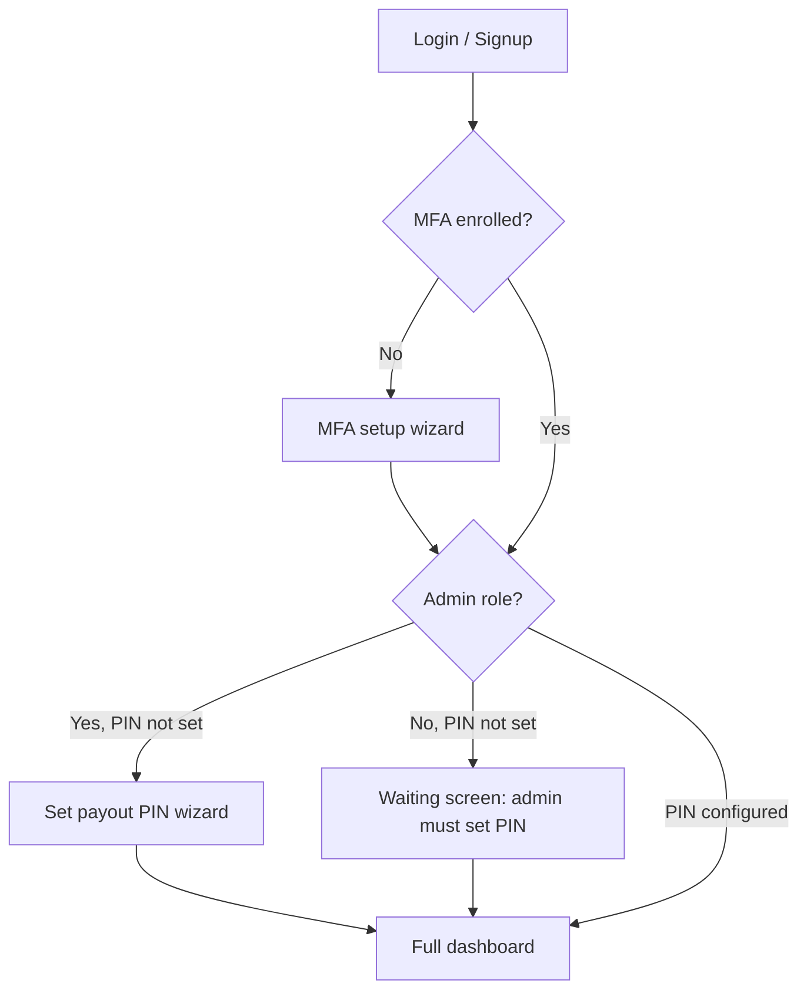

# Frontend — Merchant payout PIN + security onboarding

Implementation guide for the **merchant dashboard SPA** after payout PIN and mandatory MFA onboarding.

**Auth:** `Authorization: Bearer <portal session JWT>`

**Related:** [FRONTEND_SECURITY_UPDATE.md](./FRONTEND_SECURITY_UPDATE.md) (step-up, idempotency, roles), [FRONTEND_NGN_PORTAL.md](./FRONTEND_NGN_PORTAL.md) (NGN payouts).

**Backend migration (ops):** `npm run db:migrate-payout-pin`

---

## Summary

| Layer | What the merchant must do |
|-------|-----------------------------|
| **Login** | Password (+ TOTP if MFA enrolled) |
| **Onboarding — MFA** | Enroll authenticator app (required in production) |
| **Onboarding — payout PIN** | Admin sets a **4–6 digit PIN** once per merchant |
| **Every payout** | Enter payout PIN in request body + MFA step-up + `Idempotency-Key` |
| **PIN change (know current)** | Admin + MFA step-up (`payout_pin.write`) |
| **PIN reset (forgot)** | Email link + login + MFA step-up + new PIN |

Payout PIN is **merchant-level** (one PIN per merchant, shared by all finance/admin users who initiate payouts). Only **admin** can set, change, or reset the PIN.

---

## Server policy (env)

| Env | Effect |
|-----|--------|
| `PORTAL_MFA_REQUIRED=true` | Block `/portal/me/*` until MFA enrolled (except MFA + payout-pin setup + `GET /portal/me`) |
| *(default in production)* | MFA required when `NODE_ENV=production` unless `PORTAL_MFA_REQUIRED=false` |
| `PORTAL_PAYOUT_PIN_REQUIRED=false` | Disable payout PIN onboarding gate (payout writes still require PIN once set) |
| `PORTAL_PUBLIC_URL` | Base URL for reset email links (e.g. `https://dashboard.transacty.ai`) |

---

## Onboarding flow (recommended UI)



**Order:** MFA first → payout PIN (admin) → dashboard.

Use flags from `GET /portal/me` (or login response) to decide which screen to show:

| Field | Meaning |
|-------|---------|
| `mfaSetupRequired` | Redirect to MFA enrollment |
| `payoutPinSetupRequired` | Merchant has no PIN yet |
| `payoutPinConfigured` | PIN exists |
| `role` | `"admin"` can set PIN; `"finance"` / `"viewer"` wait for admin |

**403 during onboarding** (from any blocked `/portal/me/*` route):

```json
{
  "error": "Forbidden",
  "message": "MFA enrollment required",
  "mfaSetupRequired": true
}
```

```json
{
  "error": "Forbidden",
  "message": "Set a payout PIN to finish onboarding",
  "payoutPinSetupRequired": true,
  "payoutPinAdminRequired": false
}
```

```json
{
  "error": "Forbidden",
  "message": "An admin must set the merchant payout PIN before you can use the dashboard",
  "payoutPinSetupRequired": true,
  "payoutPinAdminRequired": true
}
```

**Allowed routes while gated:** `GET /portal/me`, `/portal/me/mfa/*`, `/portal/me/payout-pin` (GET/POST/PATCH/reset).

---

## Profile flags — `GET /portal/me`

New fields on the existing profile response:

```json
{
  "merchantId": "uuid",
  "email": "admin@merchant.com",
  "role": "admin",
  "mfaEnabled": true,
  "mfaPendingSetup": false,
  "mfaSetupRequired": false,
  "payoutPinConfigured": true,
  "payoutPinSetupRequired": false
}
```

Poll or re-fetch after MFA confirm / PIN set to unlock the app shell.

---

## Login / signup — new fields

`POST /portal/auth/login`, `POST /portal/auth/signup`, and `POST /portal/auth/mfa/verify` may include:

```json
{
  "mfaSetupRequired": true,
  "payoutPinConfigured": false,
  "payoutPinSetupRequired": true
}
```

After login, if either setup flag is true, route to onboarding before rendering the main layout.

---

## Payout PIN API

### PIN format

- **4–6 digits**, numeric only (`/^\d{4,6}$/`)
- Validate client-side before submit
- Never store in localStorage; collect at submit time only

### Status — `GET /portal/me/payout-pin`

**Response 200**

```json
{
  "configured": true,
  "lockedUntil": null
}
```

When locked after failed attempts:

```json
{
  "configured": true,
  "lockedUntil": "2026-09-04T01:15:00.000Z"
}
```

Show countdown / “try again later” when `lockedUntil` is in the future.

---

### Initial set — `POST /portal/me/payout-pin`

**Who:** admin only  
**Requires:** MFA step-up with action `payout_pin.write`

**Headers**

```http
Authorization: Bearer <session jwt>
X-Portal-Step-Up: <step-up token from POST /portal/auth/step-up>
```

**Body**

```json
{
  "pin": "123456",
  "confirmPin": "123456"
}
```

**Response 200**

```json
{ "ok": true }
```

**Errors**

| Status | When |
|--------|------|
| `400` | PIN mismatch; PIN already set |
| `403` | Not admin; step-up missing/invalid; MFA not enrolled |

---

### Change (know current PIN) — `PATCH /portal/me/payout-pin`

**Who:** admin only  
**Requires:** MFA step-up `payout_pin.write`

**Body**

```json
{
  "currentPin": "123456",
  "newPin": "654321",
  "confirmPin": "654321"
}
```

**Response 200:** `{ "ok": true }`

**Errors:** `403` wrong current PIN; `403` PIN locked

---

### Forgot PIN — request email — `POST /portal/auth/payout-pin/forgot`

**No auth required** (same pattern as password forgot).

**Body**

```json
{
  "email": "admin@merchant.com"
}
```

**Response 200** (always generic — no email enumeration)

```json
{
  "ok": true,
  "message": "If an admin account with a configured payout PIN exists for this email, reset instructions will be sent shortly."
}
```

**Notes**

- Only **admin** emails with an **existing** payout PIN receive mail
- Rate limited (`429` if abused)
- Email link format: `{PORTAL_PUBLIC_URL}/reset-payout-pin?token=<hex>`

**Suggested SPA route:** `/forgot-payout-pin` (form) and `/reset-payout-pin` (token from query + new PIN form)

---

### Complete reset — `POST /portal/me/payout-pin/reset`

**Who:** admin only, **logged in**  
**Requires:** MFA step-up `payout_pin.write`  
**Token:** from email query param (must match the logged-in admin who requested reset)

**Headers**

```http
Authorization: Bearer <session jwt>
X-Portal-Step-Up: <step-up jwt>
```

**Body**

```json
{
  "token": "<token from email URL>",
  "newPin": "135790",
  "confirmPin": "135790"
}
```

**Response 200:** `{ "ok": true }`

**Errors**

| Status | Message (examples) |
|--------|---------------------|
| `400` | Invalid or expired reset link |
| `400` | This reset link was issued to a different admin account |
| `403` | Step-up / admin checks failed |

**Reset UX flow**

1. User opens email link → `/reset-payout-pin?token=…`
2. If not logged in → login (+ MFA verify)
3. Prompt TOTP → `POST /portal/auth/step-up` with `"action": "payout_pin.write"`
4. Submit new PIN + token → `POST /portal/me/payout-pin/reset`
5. Redirect to dashboard / settings

---

## Step-up actions (updated)

`POST /portal/auth/step-up` body:

```json
{
  "code": "123456",
  "action": "money.write"
}
```

| Action | Use for |
|--------|---------|
| `money.write` | Create payout, pay-in, transfer, refund |
| `payout_pin.write` | Set / change / reset payout PIN |
| `api_keys.write` | API key create/revoke |
| `webhook.write` | Webhook URL |
| `audit.export` | Audit log CSV export |

Step-up token TTL: **5 minutes**. Header on follow-up request:

```http
X-Portal-Step-Up: <token>
```

For **payout creates**, you typically need **two** confirmations in the UI:

1. **Step-up** (`money.write`) → header  
2. **Payout PIN** → `"pin"` field in JSON body  

You can collect TOTP once and call step-up, then submit the payout with PIN in the same modal.

---

## Payout routes — `pin` required in body

All portal payout **creates** (and EU approve) require `"pin": "123456"` in the JSON body, plus existing guards:

- Portal role: `admin` or `finance`
- Header: `Idempotency-Key: <uuid>` (creates only)
- Header: `X-Portal-Step-Up` when MFA enrolled (`money.write`)

| Method | Path | Notes |
|--------|------|--------|
| `POST` | `/portal/me/payouts` | Bangladesh (BDT) |
| `POST` | `/portal/me/br/payouts` | Brazil (BRL) |
| `POST` | `/portal/me/ngn/payouts` | Nigeria (NGN) |
| `POST` | `/portal/me/eur/payout-instances` | Europe (EUR) |
| `POST` | `/portal/me/eur/payout-instances/:transactionId/approve` | Body: `{ "pin": "…" }` only |
| `POST` | `/portal/me/cpg/payout-requests` | India (CPG) |

**Example — NGN payout** (other rails: same `pin` field + existing payload)

```json
{
  "environment": "live",
  "amount": "5000",
  "beneficiary": {
    "accountNumber": "0123456789",
    "bankCode": "058",
    "accountName": "John Doe",
    "bankName": "GTBank"
  },
  "description": "Vendor payment",
  "pin": "123456"
}
```

**Not required on:** bank lists, account verify, payout GET/status, pay-ins, transfers, refunds.

---

## Payout PIN error responses (submit time)

**400 — PIN missing**

```json
{
  "error": "Bad Request",
  "message": "Payout PIN is required",
  "payoutPinRequired": true
}
```

**403 — wrong PIN**

```json
{
  "error": "Forbidden",
  "message": "Incorrect payout PIN",
  "payoutPinInvalid": true
}
```

**403 — PIN not configured (merchant)**

```json
{
  "error": "Forbidden",
  "message": "Set a payout PIN before initiating payouts",
  "payoutPinRequired": true,
  "payoutPinConfigured": false
}
```

**403 — locked (5 failed attempts, 15 min)**

```json
{
  "error": "Forbidden",
  "message": "Payout PIN is temporarily locked due to failed attempts. Try again later.",
  "payoutPinLocked": true,
  "lockedUntil": "2026-09-04T01:15:00.000Z"
}
```

**UI guidance**

- Wrong PIN: shake field, allow retry; show lock warning near 5 attempts
- Locked: disable submit until `lockedUntil`; link to forgot-PIN flow (admin)
- Not configured: admin → settings/onboarding; finance → contact admin

---

## Suggested frontend routes / components

| Route | Purpose |
|-------|---------|
| `/onboarding/mfa` | TOTP QR setup (existing) |
| `/onboarding/payout-pin` | Admin: set initial PIN |
| `/onboarding/waiting-for-admin` | Finance/viewer: PIN not set |
| `/settings/security/payout-pin` | Change PIN (admin) |
| `/forgot-payout-pin` | Request reset email |
| `/reset-payout-pin?token=…` | Complete reset (login + step-up + new PIN) |

**Components**

- `PayoutPinInput` — masked 4–6 digit field, numeric keypad on mobile
- `PayoutConfirmModal` — TOTP (step-up) + PIN + confirm button
- `SecurityOnboardingGuard` — layout wrapper reading `GET /portal/me` flags

---

## Settings / security page copy

**Set PIN (first time)**  
“Choose a 4–6 digit PIN used to authorize payouts. This PIN is shared by everyone on your team who can send money.”

**Change PIN**  
Requires current PIN + authenticator code.

**Forgot PIN**  
“We’ll email a secure link to your admin address. You’ll need to sign in and verify with your authenticator app to choose a new PIN.”

---

## Checklist

- [ ] After login, handle `mfaSetupRequired` and `payoutPinSetupRequired`
- [ ] Admin onboarding: MFA → set payout PIN → main app
- [ ] Non-admin: show waiting state when `payoutPinAdminRequired`
- [ ] Settings: change PIN (admin), forgot PIN link
- [ ] `/reset-payout-pin` page: parse `token` query, require login + step-up + reset API
- [ ] All payout forms: `pin` in body + `Idempotency-Key` + step-up header
- [ ] EU payout approve: `{ "pin": "…" }` in POST body
- [ ] Handle `payoutPinInvalid`, `payoutPinLocked`, `payoutPinRequired` errors
- [ ] Do not persist PIN in storage or logs
- [ ] Step-up action `payout_pin.write` for PIN management APIs

---

## TypeScript helpers (optional)

```typescript
export type PortalMeSecurity = {
  mfaEnabled: boolean;
  mfaPendingSetup: boolean;
  mfaSetupRequired: boolean;
  payoutPinConfigured: boolean;
  payoutPinSetupRequired: boolean;
};

export type PayoutPinErrorBody = {
  error: string;
  message?: string;
  payoutPinRequired?: boolean;
  payoutPinConfigured?: boolean;
  payoutPinInvalid?: boolean;
  payoutPinLocked?: boolean;
  lockedUntil?: string;
  payoutPinSetupRequired?: boolean;
  payoutPinAdminRequired?: boolean;
};

/** 4–6 digit numeric PIN */
export const PAYOUT_PIN_PATTERN = /^\d{4,6}$/;
```
