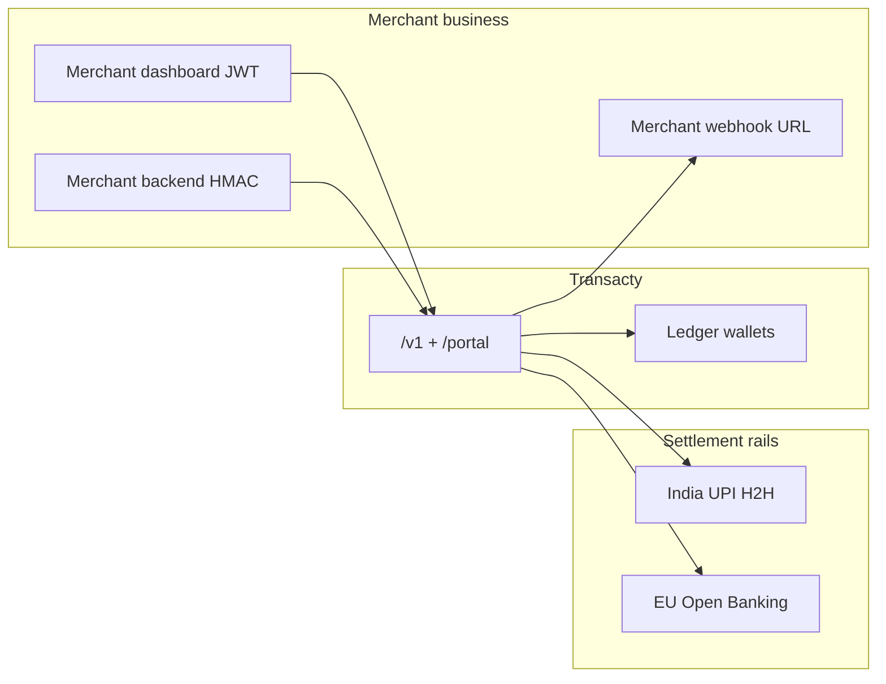
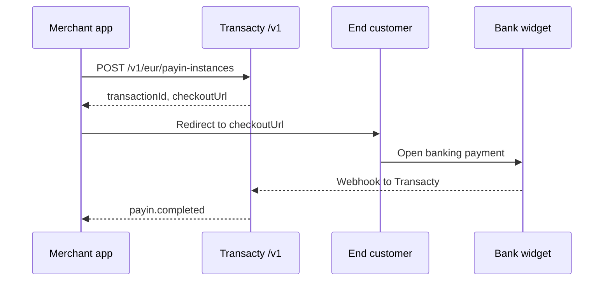

# India & Europe — merchant integration guide (dashboard + documentation)

Use this document to build **merchant-facing UI and help content** in the Transacty dashboard, and to explain what **merchant backend engineers** must implement. It covers **India (UPI H2H)** and **Europe (Open Banking → USDC)** only. Bangladesh (BDT / Payok) is separate: `docs/POSTMAN_MERCHANT_API_GUIDE.md` and portal domestic flows.

| Audience | Primary doc |
|----------|-------------|
| **Dashboard frontend** (JWT, `/portal/*`) | **This file** + `docs/PORTAL_FRONTEND_SPEC.md` |
| **Merchant server integration** (HMAC, `/v1/*`) | This file (overview) + deep dives below |
| **Postman / QA** | `docs/TYLT_MERCHANT_API_TESTING.md` (India), `docs/TYLT_EUR_OPEN_BANKING.md` (EU) |

---

## 1. Product model (what merchants must understand)

Transacty is a **B2B payments API**. Your customers are **fintechs and platforms**; their end users pay or get paid through **the merchant’s own checkout**, while money settles in **Transacty ledger wallets** per currency.

| Concept | Explanation |
|---------|-------------|
| **One merchant account** | Single signup, KYC, API keys, test/live environments. |
| **One API key type** | Scopes control pay-in, payout, balance, transfers — not separate “India keys” vs “EU keys”. |
| **Separate wallet pockets** | Each **currency** is its own balance (e.g. BDT, USDT, INR, USDC). **Do not** sum unlike currencies in one headline number. |
| **Rails** | `bangladesh` \| `india` \| `europe` \| `internal` on transaction list/detail — use for filters and badges. |
| **Portal vs API** | Dashboard uses **JWT** (`/portal/*`). Payment **creation** for India/EU is **server-side HMAC** (`/v1/*`) — **never** put the API secret in the browser. |



---

## 2. What the dashboard implements (portal API)

All portal routes require `Authorization: Bearer <portal_jwt>` (or `X-Portal-Token`). Always pass `?environment=test` or `?environment=live`.

### 2.1 Balances (multi-currency)

| Endpoint | Use in UI |
|----------|-----------|
| `GET /portal/me/wallets?environment=` | **Primary.** One card per pocket: `currency`, `balance`, `availableBalance`, `pendingBalance`, `displayLabel`, `region`, `limits`. |
| `GET /portal/me/balance?environment=` | Legacy headline row (BDT-first) **plus** same data in `items[]`. Prefer **wallets** for India/EU cards. |

**`region` / `displayLabel` mapping (for cards):**

| `region` | Typical `currency` | Suggested card title |
|----------|-------------------|----------------------|
| `bangladesh` | BDT | Bangladesh |
| `india` | USDT or INR | India (USDT) / India (INR) |
| `europe` | USDC | Europe (USDC) |

- **`availableBalance`** = settled ledger balance (spendable for payout).
- **`pendingBalance`** = sum of **pending pay-ins** in that currency (in-flight; not spendable).

### 2.2 Transactions (all rails)

| Endpoint | Query params | Use in UI |
|----------|--------------|-----------|
| `GET /portal/me/transactions` | `environment`, `rail`, `status`, `type`, `limit`, `offset` | Main table with filters **India** / **Europe** / Bangladesh / Internal. |
| `GET /portal/me/transactions/:id` | `environment` | Detail drawer: amount, status, `currency`, `rail`, `railLabel`, **`metadata`**. |

**List item fields (include on each row):** `id`, `type`, `status`, `amount`, `currency`, `rail`, `railLabel`, `platformOrderId`, `createdAt`, `completedAt`.

**Filter chips:**

| Chip | `rail` query |
|------|----------------|
| Bangladesh | `bangladesh` |
| India | `india` |
| Europe | `europe` |
| Internal | `internal` |

**Detail `metadata` keys to surface when present:**

| Key | India | Europe |
|-----|-------|--------|
| `tyltProduct` | `h2h_upi`, `cpg_payin`, `cpg_payout` | `eur_payin`, `eur_payout` |
| `payinSnapshot.tradeEventId` | UPI lifecycle (1–4, 5 dispute, 9 expired) | — |
| `disputeState` | Open/resolved dispute | — |
| `lastEventId` | — | EU upstream event id |
| `checkoutUrl` | — | May appear on create response stored in metadata |

### 2.3 API keys & webhooks (merchant setup)

| Endpoint | Use in UI |
|----------|-----------|
| `GET /portal/me/api-keys` | List keys; show **scopes** string. |
| `POST /portal/me/api-keys` | Create; show **secret once**. |
| `GET /portal/me/webhook` | Current outbound webhook URL. |
| `PATCH /portal/me/webhook` | Merchant URL for `payin.completed`, `payin.failed`, etc. |

**Recommended scope presets (copy for UI):**

| Preset | Scopes | Covers |
|--------|--------|--------|
| Full sandbox | `*` | Everything (non-prod only) |
| Cross-border + BD | `payin:create,payout:create,balance:read,internal_transfer:create` | India H2H, CPG, EU, balances |
| Read-only | `balance:read` | Dashboard balance + tx poll via API |

### 2.4 What the portal does **not** do (by design)

| Flow | Where it happens |
|------|------------------|
| India UPI checkout (QR, UTR, buyer confirm) | **Merchant’s app** via `/v1/h2h/*` on **their server** |
| EU bank widget (redirect) | **Merchant’s app** redirects to `checkoutUrl` from `/v1/eur/*` |
| EU payout approve | **Merchant’s server** `POST .../approve` when required |

The dashboard shows **balances, history, keys, webhooks** — not a replacement for hosted checkout.

---

## 3. What merchants implement on their server (HMAC `/v1/*`)

Authentication on every request:

- `X-Transacty-Key`
- `X-Transacty-Timestamp` (Unix seconds)
- `X-Transacty-Signature` = HMAC-SHA256(secret, `{timestamp}.{rawBody}`)

Details: `docs/POSTMAN_MERCHANT_API_GUIDE.md` § HMAC.

**Shared read APIs:**

| Method | Path | Notes |
|--------|------|-------|
| GET | `/v1/balance` | Primary pocket + `pendingBalance` for that currency (BDT-first if multiple). |
| GET | `/v1/transactions` | `type=payin\|payout`, includes `rail`, `railLabel`, `currency`. |
| GET | `/v1/transactions/:transactionId` | Status poll; same rail fields. |
| PATCH | `/v1/me/webhook` | Register URL for Transacty → merchant events. |

**Do not show merchants** `GET /v1/account-balance` as “their balance” — that is upstream operator crypto, not the Transacty ledger.

---

## 4. India — UPI H2H pay-in

### 4.1 Merchant-facing summary (help center copy)

> **India UPI pay-in** lets your customers pay in **INR** via UPI. You build the payment screen (QR / UPI ID). Your **server** creates a pay-in, shows payment details, collects the bank **UTR** after payment, and confirms with Transacty. When the payment completes, we credit your **INR or USDT** wallet (chosen at create) and notify your webhook.

**Supported on merchant API:** **H2H UPI only** (`/v1/h2h/*`). There is no hosted CrossRamp “pay button” create on `/v1`.

### 4.2 Integration flow (merchant backend)

```mermaid
sequenceDiagram
  participant App as Merchant app
  participant API as Transacty /v1
  participant Payer as End customer
  App->>API: POST /v1/h2h/payin-instances
  API-->>App: transactionId, instanceId, paymentDetails
  App->>Payer: Show UPI QR / VPA
  Payer->>Payer: Pays via UPI app
  App->>API: POST /v1/h2h/buyer-confirms-payment + UTR
  API-->>App: acknowledged
  Note over API: Webhooks update trade; credit on event 4 or 6
  API->>App: payin.completed webhook
```

| Step | Merchant server | Transacty API |
|------|-----------------|---------------|
| 1 | Create pay-in | `POST /v1/h2h/payin-instances` |
| 2 | Poll status or wait for webhook | `GET /v1/h2h/payin-instances/:transactionId` or `GET /v1/transactions/:id` |
| 3 | Show UPI details from `paymentDetails` / `paymentInstructions` | — |
| 4 | Customer pays in bank app; merchant collects **UTR** | — |
| 5 | Submit UTR | `POST /v1/h2h/buyer-confirms-payment` `{ transactionId, utr }` |
| 6 | Final status | `success` / `failed`; wallet credited on success |

**Create body (minimal):**

```json
{
  "amount": "500",
  "currencySymbol": "INR",
  "userDetails": { "email": "payer@example.com" }
}
```

**Create response (fields to store):**

| Field | Store as |
|-------|----------|
| `transactionId` | Primary id for confirm + portal tx row |
| `instanceId` | Platform / TL Pay instance |
| `paymentDetails` | UPI/QR payload for UI |
| `paymentInstructions` | Normalized subset for display when present |

### 4.3 UPI trade events (for status UI & support)

Use for **progress indicators** on transaction detail (from `metadata.payinSnapshot.tradeEventId` or H2H status endpoint):

| Event id | Meaning | Dashboard status suggestion |
|----------|---------|----------------------------|
| 1 | Trade initiated | Processing |
| 2 | Waiting for payment / UPI ready | Awaiting payment |
| 3 | Buyer confirmed, verifying | Verifying |
| **5** | **Disputed** | Under review (stays **pending** until resolved) |
| **4** or **6** | Completed | Success |
| **9** | Expired | Failed |

**Dispute note for support docs:** A wrong UTR may enter **dispute (5)**; operations may correct and complete as **4** without merchant resubmitting. Do not treat **5** as final failure in your copy.

**India success ≠ EU:** India completes on events **4** or **6**. (EU uses `eventId` **5** for pay-in success — different product.)

### 4.4 India API reference (merchant server)

| Method | Path | Scope |
|--------|------|--------|
| POST | `/v1/h2h/payin-instances` | `payin:create` |
| GET | `/v1/h2h/payin-instances/:transactionId` | `payin:create` |
| POST | `/v1/h2h/buyer-confirms-payment` | `payin:create` |
| GET | `/v1/h2h/payment-methods` | `payin:create` |
| GET | `/v1/h2h/conversion-rates` | `payin:create` |

Optional products (same key, different paths): `/v1/cpg/*` for crypto pay-in/out — see `docs/TYLT_MERCHANT_API_TESTING.md`.

**Transacty → merchant webhook events:** `payin.completed`, `payin.failed` (when configured).

**Deep dive / Postman:** `docs/TYLT_MERCHANT_API_TESTING.md`

---

## 5. Europe — Open Banking (EUR/GBP → USDC)

### 5.1 Merchant-facing summary (help center copy)

> **Europe Open Banking** lets your customers pay in **EUR or GBP** through a **hosted bank widget**. Your server creates a pay-in; you **redirect the customer** to `checkoutUrl`. When payment completes, we credit your **USDC** wallet. Payouts debit **USDC** and send **EUR** to a bank beneficiary; some payouts require an explicit **approve** step on your server.

### 5.2 Integration flow (merchant backend)



| Step | Merchant server | Transacty API |
|------|-----------------|---------------|
| 1 | Create pay-in | `POST /v1/eur/payin-instances` |
| 2 | Redirect browser | Use **`checkoutUrl`** from response |
| 3 | Poll or webhook | `GET /v1/eur/payin-instances/:transactionId` |
| 4 | Wallet credited | **USDC** pocket increases on success |

**Pay-in create body (minimal):**

```json
{
  "amount": "100",
  "currencySymbol": "EUR",
  "returnUrl": "https://merchant.com/payment/return",
  "merchantUrl": "https://merchant.com",
  "userDetails": { "email": "payer@example.com" }
}
```

Alternatively pass full **`merchantDetails`**: `{ merchantName, merchantUrl (HTTPS), merchantInternalId }`.

**Create response (fields to store):**

| Field | Use |
|-------|-----|
| `transactionId` | Poll + ledger tx |
| `checkoutUrl` | **Redirect end user here** |
| `instanceId` | Support / reference |
| `settlementCurrency` | Always `USDC` for display |
| `cryptoAmount` / `rate` | Optional quote display |

### 5.3 Europe payout (when merchant sends EUR out)

| Step | API |
|------|-----|
| Create payout | `POST /v1/eur/payout-instances` |
| Approve (if required) | `POST /v1/eur/payout-instances/:transactionId/approve` |
| Status | `GET /v1/eur/payout-instances/:transactionId` |

Show an **Approve payout** button in the merchant’s **admin UI** (their product, not Transacty portal) when their integration detects approval is required (metadata / status from GET).

### 5.4 EU events vs India (support table)

| | **Europe** | **India UPI** |
|--|------------|---------------|
| Success pay-in signal | `eventDetails.eventId` **5** | `trade.event.id` **4** or **6** |
| Dispute | Use TL Pay / support runbooks | `trade.event.id` **5** |
| Settlement wallet | **USDC** | **INR** or **USDT** |
| Checkout | **Redirect** `checkoutUrl` | **Merchant-built** UPI UI |

### 5.5 Europe API reference (merchant server)

| Method | Path | Scope |
|--------|------|--------|
| POST | `/v1/eur/payin-instances` | `payin:create` |
| GET | `/v1/eur/payin-instances/:transactionId` | `payin:create` |
| POST | `/v1/eur/payout-instances` | `payout:create` |
| POST | `/v1/eur/payout-instances/:transactionId/approve` | `payout:create` |
| GET | `/v1/eur/payout-instances/:transactionId` | `payout:create` |

Legacy alias: `/v1/tylt/eur/...` (same handlers).

**Deep dive / Postman:** `docs/TYLT_EUR_OPEN_BANKING.md`

---

## 6. Dashboard pages — suggested UX map

Use this as a sitemap for frontend + in-app docs links.

| Page | Data source | India / EU notes |
|------|-------------|------------------|
| **Overview / Balances** | `GET /portal/me/wallets` | Cards for USDT/INR (India), USDC (Europe), BDT (BD). Show `pendingBalance`. |
| **Transactions** | `GET /portal/me/transactions?rail=` | Filters: All, Bangladesh, **India**, **Europe**. Columns: date, type, amount, currency, **railLabel**, status. |
| **Transaction detail** | `GET /portal/me/transactions/:id` | Badge from `railLabel`; optional “Technical” panel for `metadata`. |
| **API keys** | `/portal/me/api-keys` | Explain scopes; link to **Integration guide** (this doc). |
| **Webhooks** | `/portal/me/webhook` | Explain events apply to all rails. |
| **Integration / Docs** | Static + links | **India:** server H2H flow diagram. **EU:** redirect `checkoutUrl` diagram. Link to Postman docs for engineers. |

**In-app “How to go live” checklist (merchant-facing):**

1. Complete KYC (portal activation).
2. Create API key with `payin:create`, `payout:create`, `balance:read`.
3. Implement server integration (India and/or EU section above).
4. Set webhook URL; handle `payin.completed` / `payin.failed`.
5. Test in `environment=test`; switch keys to `live` when ready.

---

## 7. Transaction & wallet status glossary (UI copy)

| `status` | Label | Description |
|----------|-------|-------------|
| `pending` | Pending | Not finalized; may include India dispute (event 5). |
| `success` | Completed | Settled; wallet credited (pay-in) or payout completed. |
| `failed` | Failed | Terminal failure (e.g. expired, rejected). |

---

## 8. Errors merchants see (display tips)

| HTTP | Typical cause | UI message direction |
|------|---------------|----------------------|
| 401 | Bad/missing HMAC | Check API key and clock skew. |
| 403 | Missing scope or KYC | Add scope or complete verification. |
| 400 | Validation / provider reject | Show `message`; may include `code: payment_provider_rejected`. |
| 503 | Provider unavailable | Retry shortly. |

Portal routes return the same JSON `{ error, message }` shape.

---

## 9. Test vs live

| | **test** | **live** |
|--|----------|----------|
| Portal query | `?environment=test` | `?environment=live` |
| API key | Created for test or live environment | Separate key |
| Balances | Separate ledger pockets | Production money |

Always show a clear **environment switch** in the dashboard so merchants do not confuse test USDC with live USDC.

---

## 10. Related documentation index

| Document | Purpose |
|----------|---------|
| `docs/PORTAL_FRONTEND_SPEC.md` | Portal auth, KYC, all `/portal/me/*` routes |
| `docs/TYLT_MERCHANT_API_TESTING.md` | India H2H/CPG Postman, HMAC scripts |
| `docs/TYLT_EUR_OPEN_BANKING.md` | EU Postman, webhooks, approve flow |
| `docs/MERCHANT_ONBOARDING_SIMPLE.md` | Onboarding + webhooks overview |
| `docs/POSTMAN_PORTAL_TESTING.md` | Portal API smoke tests |

---

## 11. FAQ (for merchant help center)

**Q: Can we run India or EU from the browser with our API key?**  
A: No. Create pay-ins and payouts from your **server** only. The dashboard uses a separate login (JWT).

**Q: Which wallet receives India payments?**  
A: The pocket matching `currencySymbol` at create (**INR** or **USDT**). See **Balances**.

**Q: Which wallet receives EU payments?**  
A: **USDC** (Europe region card).

**Q: Why is my pay-in still pending after UTR?**  
A: Verification can take time; India may show **dispute** before **completed**. Poll `GET /v1/transactions/:id` or wait for webhooks.

**Q: Do we need separate integrations for India and EU?**  
A: Different API paths (`/v1/h2h/*` vs `/v1/eur/*`) and UX (UPI vs redirect). Same API key, same transaction list, same webhook URL.

---

*Last updated: aligns with implemented `/v1/h2h/*`, `/v1/eur/*`, portal `wallets` + `transactions` rail filters, India dispute event 5 handling, and computed `pendingBalance`.*
