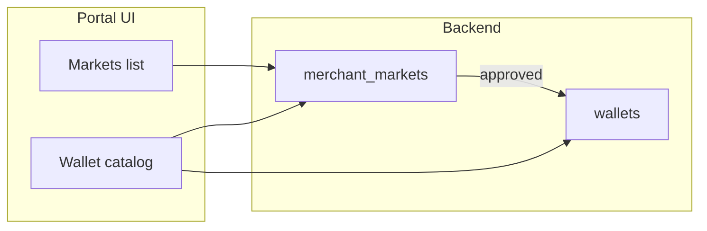
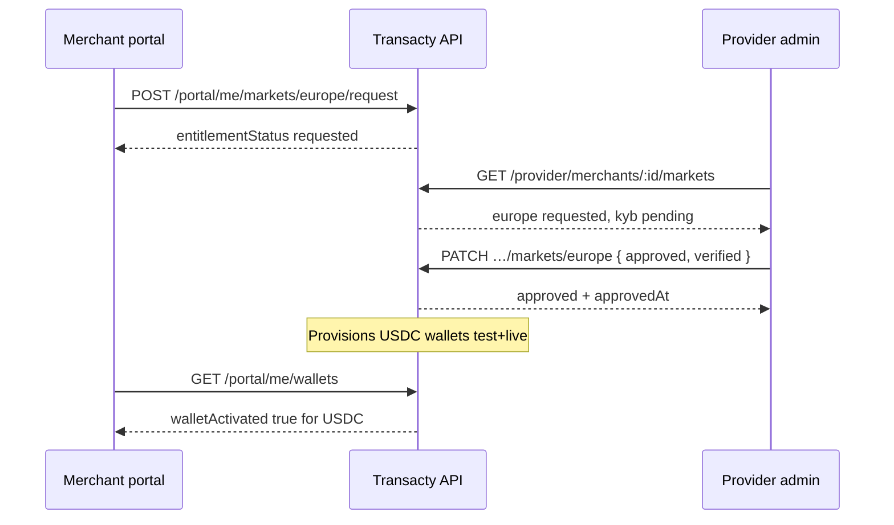

# Markets & Wallets — Frontend Spec (Portal + Admin)

> **Single source of truth** for **merchant portal** markets/wallets and **provider admin** market approval (June 2026). Login, MFA, and other portal routes: [`PORTAL_FRONTEND_SPEC.md`](./PORTAL_FRONTEND_SPEC.md). Provider auth/MFA: [`PROVIDER_FRONTEND_SPEC.md`](./PROVIDER_FRONTEND_SPEC.md).

## Dashboard services board (Aug 2026)

Prefer **one load** for overview:

| App | Endpoint |
|-----|----------|
| Merchant | `GET /portal/me/services?environment=test\|live` |
| Admin | `GET /provider/merchants/:id/services?environment=test\|live` |

Returns `globalKycStatus`, `markets[]` (with unlock reasons), and `wallets[]` (same catalog as `/wallets`, plus `unlockReason` / `blockers`).

Each **market** row now includes:

| Field | Meaning |
|-------|---------|
| `displayName` | Human label |
| `activationStatus` | `active` \| `not_enabled` \| `pending_kyb` \| `suspended` |
| `canRequest` | Show **Request access** when `true` |
| `ready` | Usable for money flows |
| `unlockReason` | Single sentence why locked (`null` when ready) |
| `blockers[]` | `{ code, message }` codes: `not_requested`, `awaiting_review`, `kyb_pending`, `kyb_rejected`, `global_kyc_pending`, `suspended`, `wallet_not_provisioned`, `live_only` |
| `walletsProvisioned` | Settlement wallet exists for env |

`GET /portal/me/markets` and `GET /provider/merchants/:id/markets` return the same enriched market rows (+ `globalKycStatus`). Optional `?environment=` defaults to `live` (wallet provision check).

Wallet catalog items (`/wallets`, `/balance`, `/services`) also include `unlockReason` + `blockers`.

---

**Two apps:**

| App | Users | This doc |
|-----|-------|----------|
| Merchant portal | Merchants | [Part A — Merchant portal](#part-a--merchant-portal) |
| Provider / superadmin dashboard | Transacty ops | [Part B — Provider admin](#part-b--provider-admin) |

---

## Backend setup (run before testing portal)

Requires `DATABASE_URL` or `DATABASE_URL_ENC` in `.env` (same as the API).

From the repo root:

```bash
# Apply merchant_markets table + seed + wallet backfill (idempotent)
npm run db:migrate-merchant-markets

# Preview SQL without connecting
npx tsx scripts/migrate-merchant-markets.ts --dry-run
```

What it runs: `drizzle/0021_merchant_markets.sql` via `scripts/migrate-merchant-markets.ts` (`runMerchantMarketsMigration()`).

| Step | Effect |
|------|--------|
| CREATE TABLE | `merchant_markets` with unique `(merchant_id, market)` |
| INSERT | Three rows per merchant: `bangladesh`, `india`, `europe` (default `disabled`) |
| UPDATE backfill | `approved` + `verified` where an active merchant wallet already exists for that region |

Safe to re-run on deploy. On **Render**, run once in the shell or as a one-off job with production `DATABASE_URL`.

After migration, restart the API and implement both portal and provider UIs against the endpoints below.

---

## Part A — Merchant portal

## What changed (product)

Merchants no longer get a single implicit “Bangladesh-only” wallet on signup. Each **payment market** is a separate entitlement:

| Market ID     | Display name | Settlement pockets (currencies) | Typical rails (API, not portal)      |
|---------------|--------------|----------------------------------|--------------------------------------|
| `bangladesh`  | Bangladesh   | `BDT`                            | Payok pay-in / pay-out               |
| `india`       | India        | `USDT`                           | H2H, CPG, internal transfer          |
| `europe`      | Europe       | `USDC`                           | EUR open banking pay-in / EUR payout |

- **New signups:** all three markets start **`disabled`**; no wallets until a market is **approved**.
- **Existing merchants:** migration may **auto-approve** markets that already had matching wallets (BDT → Bangladesh, INR/USDT → India, USDC → Europe).
- **Europe** is usually **disabled** until the merchant requests it and operations approves KYB.

The portal should show **all three markets** in the UI (catalog), not only DB wallet rows that happen to exist.

---

## Mental model



1. **`GET /portal/me/markets`** — entitlement + KYB per market (source of truth for “can we use this country?”).
2. **`GET /portal/me/wallets`** / **`GET /portal/me/balance`** — **catalog** = every settlement currency for every market, merged with real wallet rows when they exist.
3. **Provider** approves markets (not in this doc). Merchant can **`POST …/markets/:market/request`** to start activation.

**Global KYC** (activation wizard) is still required for many flows. Per-market **KYB** can also gate API use until `kybStatus` is `verified` (or global KYC is already `verified`).

---

## Endpoints

All require portal auth: `Authorization: Bearer <session_jwt>` (see main spec).

### List markets

**GET** `/portal/me/markets`

**Response (200)**

```json
{
  "items": [
    {
      "market": "bangladesh",
      "entitlementStatus": "approved",
      "kybStatus": "verified",
      "requestedAt": null,
      "approvedAt": "2026-06-01T12:00:00.000Z",
      "settlementCurrencies": ["BDT"]
    },
    {
      "market": "india",
      "entitlementStatus": "disabled",
      "kybStatus": "not_started",
      "requestedAt": null,
      "approvedAt": null,
      "settlementCurrencies": ["USDT"]
    },
    {
      "market": "europe",
      "entitlementStatus": "requested",
      "kybStatus": "pending",
      "requestedAt": "2026-06-02T09:00:00.000Z",
      "approvedAt": null,
      "settlementCurrencies": ["USDC"]
    }
  ]
}
```

Items are always returned in order: **bangladesh → india → europe**.

### Request market activation

**POST** `/portal/me/markets/:market/request`

`:market` must be one of: `bangladesh`, `india`, `europe`.

**Response (200)** — same shape as one `items[]` element from `GET /portal/me/markets`.

**Errors**

| Status | Body | When |
|--------|------|------|
| 400 | `{ "error": "Bad Request", "message": "Invalid market" }` | Unknown `:market` |
| 401 | `{ "error": "Unauthorized" }` | Missing/invalid JWT |

**Side effect:** sets `entitlementStatus` to `requested` and updates `kybStatus` (`pending` if global KYC already verified, else `not_started`). Does **not** auto-approve; operations must approve via provider tools.

### Wallet catalog

**GET** `/portal/me/wallets?environment=test|live` (default: `test`)

**GET** `/portal/me/balance?environment=test|live` (default: `test`)

Both build the same **`items[]`** catalog. `/balance` also returns **top-level** headline fields from a **primary** item (see below).

**Response (200) — wallets**

```json
{
  "environment": "test",
  "items": [
    {
      "id": "550e8400-e29b-41d4-a716-446655440000",
      "currency": "BDT",
      "balance": "1000.00",
      "availableBalance": "1000.00",
      "pendingBalance": "0.00",
      "status": "active",
      "label": null,
      "displayLabel": "Bangladesh",
      "region": "bangladesh",
      "regionLabel": "Bangladesh",
      "lastUpdated": "2026-06-02T10:00:00.000Z",
      "updatedAt": "2026-06-02T10:00:00.000Z",
      "createdAt": "2026-05-01T08:00:00.000Z",
      "limits": {
        "payin": { "min": 10, "max": 50000 },
        "payout": { "min": 10, "max": 50000 }
      },
      "market": "bangladesh",
      "entitlementStatus": "approved",
      "kybStatus": "verified",
      "activationStatus": "active",
      "walletActivated": true
    },
    {
      "id": "market:europe:USDC",
      "currency": "USDC",
      "balance": "0.00",
      "availableBalance": "0.00",
      "pendingBalance": "0.00",
      "status": "inactive",
      "label": null,
      "displayLabel": "Europe (USDC)",
      "region": "europe",
      "regionLabel": "Europe (USDC)",
      "lastUpdated": null,
      "updatedAt": null,
      "createdAt": "1970-01-01T00:00:00.000Z",
      "limits": { "payin": { "min": 1, "max": 100000 }, "payout": { "min": 1, "max": 100000 } },
      "market": "europe",
      "entitlementStatus": "disabled",
      "kybStatus": "not_started",
      "activationStatus": "not_enabled",
      "walletActivated": false
    }
  ]
}
```

**Balance top-level (compat headline)**

```json
{
  "environment": "test",
  "balance": "1000.00",
  "availableBalance": "1000.00",
  "pendingBalance": "0.00",
  "currency": "BDT",
  "lastUpdated": "2026-06-02T10:00:00.000Z",
  "limits": { "payin": { "min": 10, "max": 50000 }, "payout": { "min": 10, "max": 50000 } },
  "items": [ "... same as wallets ..." ]
}
```

If there are no items at all, top-level defaults to `currency: "BDT"`, zero balances, and `items: []`.

---

## Field reference

### Market row (`GET /portal/me/markets`)

| Field | Type | Meaning |
|-------|------|---------|
| `market` | `"bangladesh" \| "india" \| "europe"` | Stable key for routes and grouping |
| `entitlementStatus` | see below | Ops/merchant lifecycle for the market |
| `kybStatus` | see below | Market-specific KYB |
| `requestedAt` | ISO string \| null | When merchant requested activation |
| `approvedAt` | ISO string \| null | When market was approved |
| `settlementCurrencies` | `string[]` | Currencies provisioned on approval |

**`entitlementStatus`**

| Value | Suggested UI |
|-------|----------------|
| `disabled` | “Not enabled” — show **Request access** |
| `requested` | “Requested” — waiting on review |
| `kyb_in_review` | “Under review” |
| `approved` | “Active” (subject to KYB / wallet) |
| `suspended` | “Suspended” — contact support |

**`kybStatus`**

| Value | Suggested UI |
|-------|----------------|
| `not_started` | Prompt to complete global activation / KYB |
| `pending` | KYB submitted or in progress |
| `verified` | KYB OK for this market |
| `rejected` | Show rejection + support |

### Wallet catalog item (`items[]`)

| Field | Type | Meaning |
|-------|------|---------|
| `id` | string | Real wallet UUID **or** synthetic `market:{market}:{CURRENCY}` |
| `market` | market id | Group cards under this market |
| `entitlementStatus` | string | Copy of market entitlement at catalog build time |
| `kybStatus` | string | Copy of market KYB |
| `activationStatus` | `"active" \| "not_enabled" \| "pending_kyb" \| "suspended"` | **Use this for card chrome** |
| `walletActivated` | boolean | `true` only if DB wallet exists **and** `activationStatus === "active"` |
| `balance` / `availableBalance` | string | Decimal strings, 2 dp when zero |
| `pendingBalance` | string | Pending pay-ins for that currency |
| `displayLabel` / `regionLabel` | string | Human label (e.g. “India (USDT)”, “Europe (USDC)”) |
| `region` | string | `bangladesh` \| `india` \| `europe` \| `other` |
| `status` | string | Wallet row status or `inactive` for placeholders |
| `limits` | object | Pay-in / pay-out min/max for UI hints |

**`activationStatus` derivation (for UI logic)**

| Market `entitlementStatus` | Market `kybStatus` | `activationStatus` |
|----------------------------|--------------------|--------------------|
| `suspended` | any | `suspended` |
| `approved` | `verified` | `active` |
| `approved` | not `verified` | `pending_kyb` |
| `requested` or `kyb_in_review` | any | `pending_kyb` |
| else (`disabled`, etc.) | any | `not_enabled` |

**Synthetic IDs:** `id` values like `market:europe:USDC` are **placeholders**. Do not use them for transfers, payouts, or customer-wallet APIs. Treat the row as informational until `walletActivated === true`.

---

## Recommended UI

### 1. Markets settings page (new)

- On load: `GET /portal/me/markets`.
- Render **three rows** (Bangladesh / India / Europe) with status badge from `entitlementStatus` + `kybStatus`.
- **CTA:** `POST /portal/me/markets/europe/request` (etc.) when `entitlementStatus === "disabled"`.
- Disable button when already `requested`, `kyb_in_review`, or `approved`.
- Copy: “Each market has separate KYB. API access for that region is enabled after approval.”

### 2. Dashboard wallets (update existing)

- Prefer **`GET /portal/me/wallets`** (or `balance.items`) over assuming only BDT exists.
- **Group by `market`** (section headers: Bangladesh, India, Europe).
- Within each section, one card per `currency` in catalog order.
- Card states:
  - **`walletActivated`:** show balances, pending, limits; allow actions that need a real wallet id.
  - **`activationStatus === "not_enabled"`:** zero balance, CTA “Request market access” → markets page or inline request.
  - **`pending_kyb`:** “Complete verification” / link to activation wizard.
  - **`suspended`:** blocked styling + support link.

### 3. Environment toggle

- Keep `?environment=test|live` on wallets and balance (unchanged).
- Wallets are provisioned in **both** environments when a market is approved; catalog respects the selected environment.

### 4. Headline balance widget

- Top-level fields on `/portal/me/balance` pick **primary** item: prefers `activationStatus === "active"`, then activated wallets, then BDT, then currency sort.
- For multi-market merchants, **do not** rely on top-level alone — use **`items`** for the full picture.
- Optional: let user pin a primary currency in frontend state.

### 5. Programmatic API errors (merchant server / Postman)

If the merchant’s **server** calls `/v1` while a market is off, responses may include:

```json
{
  "error": "Forbidden",
  "message": "Payment market \"europe\" is not enabled. Request activation in the merchant portal.",
  "code": "market_not_enabled",
  "market": "europe"
}
```

Other codes: `market_kyb_required`, `market_suspended`. Portal UI can mirror this copy on disabled market sections.

---

## TypeScript types (copy-paste)

```typescript
export type MerchantMarket = "bangladesh" | "india" | "europe";

export type MarketEntitlementStatus =
  | "disabled"
  | "requested"
  | "kyb_in_review"
  | "approved"
  | "suspended";

export type MarketKybStatus = "not_started" | "pending" | "verified" | "rejected";

export type WalletActivationStatus =
  | "active"
  | "not_enabled"
  | "pending_kyb"
  | "suspended";

export interface PortalMarketRow {
  market: MerchantMarket;
  entitlementStatus: MarketEntitlementStatus;
  kybStatus: MarketKybStatus;
  requestedAt: string | null;
  approvedAt: string | null;
  settlementCurrencies: string[];
}

export interface PortalWalletBalanceItem {
  id: string;
  currency: string;
  balance: string;
  availableBalance: string;
  pendingBalance: string;
  status: string;
  label: string | null;
  displayLabel: string;
  region: MerchantMarket | "other";
  regionLabel: string;
  lastUpdated: string | null;
  updatedAt: string | null;
  createdAt: string;
  limits: {
    payin: { min: number; max: number };
    payout: { min: number; max: number };
  };
  market: MerchantMarket;
  entitlementStatus: MarketEntitlementStatus;
  kybStatus: MarketKybStatus;
  activationStatus: WalletActivationStatus;
  walletActivated: boolean;
}

export function isSyntheticWalletId(id: string): boolean {
  return id.startsWith("market:");
}
```

---

## Suggested data loading

```typescript
// Dashboard shell (after auth + environment known)
const [profile, markets, wallets] = await Promise.all([
  api.get("/portal/me"),
  api.get("/portal/me/markets"),
  api.get(`/portal/me/wallets?environment=${env}`),
]);

// Group wallet cards
const byMarket = Object.groupBy(wallets.items, (w) => w.market);
```

After **request market**:

```typescript
await api.post(`/portal/me/markets/${market}/request`);
// Refetch markets + wallets
```

---

## Migration checklist (frontend)

- [ ] Replace “single BDT wallet on signup” assumptions; empty catalog is valid for new merchants.
- [ ] Stop filtering wallet list to “only rows from API with non-zero balance”.
- [ ] Add markets settings / request flow.
- [ ] Group wallet cards by `market`; show placeholder cards for disabled markets.
- [ ] Gate actions that need a real wallet id on `walletActivated`.
- [ ] Update balance headline to use `items` when `items.length > 1` or any non-BDT market is active.
- [ ] Copy updates: India and Europe are **separate KYB**, not automatic with signup.

---

## Part B — Provider admin

Ops **approves payment markets** (Bangladesh / India / Europe / Brazil / **PYUSD**), not individual wallet rows. When a market is **approved**, the backend **auto-creates** settlement wallets (test + live). There is no `POST …/wallets/:id/activate`.

**Where in the app:** Merchant detail page (`/merchants/:merchantId`) — add a **Payment markets** panel (one row per market, including **`pyusd`**). Optional: dashboard widget for merchants with any `entitlementStatus === "requested"`.

**Auth:** Provider session JWT — `Authorization: Bearer <provider_jwt>` (see [`PROVIDER_FRONTEND_SPEC.md`](./PROVIDER_FRONTEND_SPEC.md)).

**Permission:** `merchant.kyc.write` (same as global KYC approve/reject). Hide actions if the role lacks this permission.

**No step-up MFA** on market PATCH (unlike wallet adjustments).

**PYUSD note:** market `pyusd` settles **PYUSD-USDC** (display **PYUSD USDC**), a separate wallet from Europe **USDC**. Tekko has no sandbox: the settlement pocket is **live-only**. On `?environment=test`, an approved PYUSD card stays `entitlementStatus: "approved"` with blocker `live_only` (switch to live) — not `wallet_not_provisioned`. Portal create: [`FRONTEND_PYUSD_PORTAL.md`](./FRONTEND_PYUSD_PORTAL.md). Provider reconcile: [`FRONTEND_PYUSD_PROVIDER.md`](./FRONTEND_PYUSD_PROVIDER.md).

### End-to-end flow



### Read markets (admin list)

**GET** `/provider/merchants/:merchantId/markets`

**Permission:** `merchant.read`

**Response (200)**

```json
{
  "items": [
    {
      "market": "bangladesh",
      "entitlementStatus": "approved",
      "kybStatus": "verified",
      "requestedAt": null,
      "approvedAt": "2026-06-01T12:00:00.000Z",
      "settlementCurrencies": ["BDT"]
    },
    {
      "market": "europe",
      "entitlementStatus": "requested",
      "kybStatus": "pending",
      "requestedAt": "2026-06-02T09:00:00.000Z",
      "approvedAt": null,
      "settlementCurrencies": ["USDC"]
    }
  ]
}
```

Same field meanings as [merchant `GET /portal/me/markets`](#list-markets). Items order: `bangladesh` → `india` → `europe`.

### Approve / reject / suspend market

**PATCH** `/provider/merchants/:merchantId/markets/:market`

| Param | Values |
|-------|--------|
| `:merchantId` | UUID |
| `:market` | `bangladesh` \| `india` \| `europe` |

**Headers**

```
Authorization: Bearer <provider_jwt>
Content-Type: application/json
```

**Body** (all fields optional; send at least one)

```json
{
  "entitlementStatus": "approved",
  "kybStatus": "verified",
  "reason": "KYB docs reviewed — EU entity verified"
}
```

| Field | Type | Notes |
|-------|------|-------|
| `entitlementStatus` | `disabled` \| `requested` \| `kyb_in_review` \| `approved` \| `suspended` | **`approved`** triggers wallet provisioning |
| `kybStatus` | `not_started` \| `pending` \| `verified` \| `rejected` | Market-specific KYB |
| `reason` | string, max 500 | Stored in audit meta (not shown to merchant) |

**Success (200)**

```json
{
  "market": "europe",
  "entitlementStatus": "approved",
  "kybStatus": "verified",
  "requestedAt": "2026-06-02T09:00:00.000Z",
  "approvedAt": "2026-06-02T14:30:00.000Z"
}
```

**Errors**

| Status | Example | When |
|--------|---------|------|
| 401 | `{ "error": "Unauthorized" }` | Missing/invalid JWT |
| 403 | `{ "error": "Forbidden", "message": "…" }` | Role lacks `merchant.kyc.write` |
| 404 | `{ "error": "Not found", "message": "Merchant not found" }` | Bad `merchantId` |

**Side effects on `entitlementStatus: "approved"`**

- Sets `approvedAt` if not already set
- If global merchant `kycStatus === "verified"` and `kybStatus` omitted → backend sets market `kybStatus` to `verified`
- Creates merchant settlement wallets for that market in **test** and **live** (BDT / INR+USDT / USDC)

### Recommended admin actions

| Operator intent | PATCH body |
|-----------------|------------|
| **Approve** market after KYB | `{ "entitlementStatus": "approved", "kybStatus": "verified", "reason": "…" }` |
| Mark **under review** | `{ "entitlementStatus": "kyb_in_review", "kybStatus": "pending" }` |
| **Reject** KYB | `{ "kybStatus": "rejected", "reason": "…" }` (keep or set `entitlementStatus` as policy) |
| **Suspend** rail | `{ "entitlementStatus": "suspended" }` |
| **Disable** market | `{ "entitlementStatus": "disabled" }` |

Global KYC on the same merchant detail page (`PATCH /provider/merchants/:merchantId/kyc`) is **separate** but related: verified global KYC can satisfy market KYB checks on the API even if market `kybStatus` is still `pending`.

### Admin UI — Payment markets panel

**Load:**

```typescript
GET /provider/merchants/${merchantId}/markets
```

Also show merchant **`kycStatus`** from `GET /provider/merchants/:merchantId` for context.

**Table columns**

| Column | Source |
|--------|--------|
| Market | `market` → label: Bangladesh / India / Europe |
| Status | `entitlementStatus` badge |
| Market KYB | `kybStatus` |
| Settlement | `settlementCurrencies` joined (e.g. `USDC`) |
| Requested | `requestedAt` |
| Approved | `approvedAt` |
| Actions | Approve / Reject / Suspend / Disable |

**Row actions**

- **`requested` or `kyb_in_review`** → primary **Approve** → PATCH with `approved` + `verified`; confirm modal mentioning wallets will be created
- **Reject** → PATCH `kybStatus: "rejected"` (+ optional `entitlementStatus: "disabled"`)
- **`approved`** → **Suspend** → PATCH `entitlementStatus: "suspended"`
- **`suspended`** → **Re-enable** → PATCH `approved` again (re-provisions wallets if needed)

After PATCH, replace row from **response body**; optionally refetch merchant **wallets** on overview (`GET /provider/merchants/:merchantId/overview` → `wallets[]`) to show new BDT/INR/USDT/USDC rows.

**Badge copy (admin)**

| `entitlementStatus` | Label |
|---------------------|-------|
| `disabled` | Not enabled |
| `requested` | **Needs review** |
| `kyb_in_review` | KYB in review |
| `approved` | Active |
| `suspended` | Suspended |

### Pending requests queue (optional v1.1)

No dedicated `GET /provider/markets/requests` exists. v1 options:

- Filter merchant list client-side after enriching each merchant (expensive), or
- Backend adds a queue endpoint later

For v1, **merchant detail** driven by `requested` / `kyb_in_review` rows is enough.

### Admin checklist

- [ ] Block panel actions unless user has `merchant.kyc.write`
- [ ] Load markets with `GET /provider/merchants/:merchantId/markets` on merchant detail open
- [ ] Approve modal copy: wallets auto-created; merchant sees them on next portal refresh
- [ ] Link to global KYC section on same page when `kybStatus` is `not_started` / `pending`
- [ ] Audit: `provider.merchant.market_updated` appears in merchant overview audit trail after PATCH

---

## Out of scope (this doc)

| Topic | Where |
|-------|--------|
| Login, MFA, KYC wizard (merchant) | [`PORTAL_FRONTEND_SPEC.md`](./PORTAL_FRONTEND_SPEC.md) |
| Provider login, MFA, step-up (other actions) | [`PROVIDER_FRONTEND_SPEC.md`](./PROVIDER_FRONTEND_SPEC.md) |
| HMAC `/v1` pay-in, payout payloads | [`MERCHANT_INDIA_EUR_INTEGRATION.md`](./MERCHANT_INDIA_EUR_INTEGRATION.md), [`TYLT_MERCHANT_API_TESTING.md`](./TYLT_MERCHANT_API_TESTING.md) |

---

## Other docs

- [`PORTAL_FRONTEND_SPEC.md`](./PORTAL_FRONTEND_SPEC.md) — merchant portal (balance/wallets sections there are **not** updated for markets; use **Part A** here)
- [`PROVIDER_FRONTEND_SPEC.md`](./PROVIDER_FRONTEND_SPEC.md) — provider shell, auth, merchant detail shell (add **Part B** markets panel there)
- [`MERCHANT_INDIA_EUR_INTEGRATION.md`](./MERCHANT_INDIA_EUR_INTEGRATION.md) — merchant **server** `/v1` integration (HMAC)
