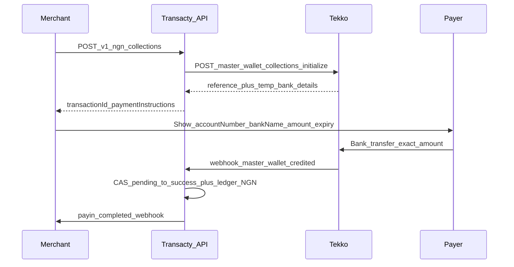

# Tekko NGN — phase 1 implementation plan

**Status:** planning artifact only (no collect routes shipped yet).  
**Product locks:** [`.cursor/rules/60-tekko-ngn.mdc`](../.cursor/rules/60-tekko-ngn.mdc)  
**Ops entitlement:** [`TEKKO_NGN_OPS_ENTITLEMENT.md`](./TEKKO_NGN_OPS_ENTITLEMENT.md)  
**Vendor docs:** [Fiat Collections](https://docs.tekkoglobal.com/collections), [Master Wallet & NGN](https://docs.tekkoglobal.com/master-wallet)

Phase 1 = **NGN collection only** for Transacty merchants via Tekko, isolated from PYUSD / PayOK / Tylt / Waverlite.

---

## 1. Locked product decisions

| Decision | Lock |
|----------|------|
| Collect model | Exact-amount **temporary bank** (~2h) |
| Tekko credit target | **Master wallet** `POST /master-wallet/collections/initialize` |
| Transacty wallet | Credit merchant **NGN** pocket |
| BVN on our API | **None** in phase 1 (master temporary collect) |
| Payout / VA / swaps / MoMo | **Out of scope** |
| Environment | **Live-only** (same Tekko Platform as PYUSD) |

---

## 2. Merchant-facing flow

Fallback: `GET …/collections/:reference/status` until `credited` | `failed` | `expired`, then reconcile.

---

## 3. Market & money model

Mirror PYUSD market isolation in [`src/lib/merchant-markets.ts`](../src/lib/merchant-markets.ts):

| Item | Value |
|------|--------|
| Market id | `nigeria` (preferred; aligns with domestic nigeria folder naming) |
| Settlement currencies | `["NGN"]` only |
| Display | `NGN` |
| Entitlement | Provider approves `nigeria` market before API create |
| Wallet provision | On approve: provision `NGN` settlement wallet (live; fail closed on `test` for Tekko calls) |
| Currency constant | New helper e.g. `src/lib/ngn-settlement.ts` exporting `NGN_SETTLEMENT_CURRENCY = "NGN"` |

Do **not** mix with Europe `USDC` or `PYUSD-USDC`.

---

## 4. Adapter (Tekko package)

New file(s) under [`services/integrations/tekko/`](../services/integrations/tekko/) — **do not** edit `pyusd-payin.ts` logic for NGN:

| Module | Responsibility |
|--------|----------------|
| `ngn-collect.ts` | Create pending tx → Tekko initialize → store reference + provider bank fields in metadata → status poll → settle credit |
| `webhooks.ts` (extend carefully) | Route `master_wallet.credited` with NGN collection `reference` / `currency` to NGN settle path; keep PYUSD `settlementStatus` gate unchanged |
| Reuse | `client.ts`, `sign.ts`, `config.ts`, `static-proxy.ts`, `diagnostics.ts` pattern |

**Provider id / rail:** `tekko-ngn-collect`

**Tekko calls:**

1. `POST /master-wallet/collections/initialize` + `Idempotency-Key`  
   Body: `{ currency: "NGN", amount, description?, payload: { type: "BANK", accountName } }`
2. `GET /master-wallet/collections/:reference/status`
3. Optional: `GET /collections/supported` for health/diagnostics

**Credit rule:**

- Credit Transacty NGN only when Tekko status is `credited` **or** webhook proves credit with matching `reference` + `currency: NGN`.
- Fail closed on `failed` / `expired` / unknown.
- Dedupe: webhook claim (`rail: tekko-ngn-collect`) + `pending` → `success` CAS + ledger `referenceId` uniqueness (same pattern as PYUSD).

**Payer fields on create (merchant → us):** at minimum `amount`, `accountName` (payer/sender name for Tekko payload), optional `description` / `merchantReference`.

---

## 5. HTTP surfaces

### Merchant HMAC (`app.ts`)

| Method | Path | Scope | Notes |
|--------|------|-------|-------|
| `POST` | `/v1/ngn/collections` | `payin:create` | KYC + `assertMerchantMarketApiAccess({ market: "nigeria" })`; `withIdempotency` |
| `GET` | `/v1/ngn/collections/:transactionId` | `payin:create` | Poll; may refresh Tekko status |

Response sketch:

- `transactionId`, `status`, `amount`, `currency: "NGN"`, `settlementCurrency: "NGN"`
- `reference` (Tekko collection ref)
- `paymentInstructions`: `{ accountNumber, bankName, accountName, expiryDate }`
- `environment: "live"`

### Portal JWT

New [`api/portal/ngn-collections.ts`](../api/portal/) (name TBD):

- `POST /portal/me/ngn/collections`
- `GET /portal/me/ngn/collections/:transactionId`

Same live-only + market gates as HMAC.

### Webhooks

Existing `POST /webhooks/tekko/:environment`:

- Verify HMAC (`TEKKO_WEBHOOK_SECRET`)
- Branch by event + payload: PYUSD settle path vs NGN collect path
- NGN: claim with rail `tekko-ngn-collect`, apply credit, enqueue merchant `payin.completed` / `payin.failed`

### Provider admin

- Market approve `nigeria` (existing markets machinery + new id)
- Optional: `POST /provider/tekko/ngn/reconcile` by `transactionId` (status pull + settle) — mirror PYUSD reconcile

---

## 6. Persistence

| Need | Approach |
|------|----------|
| Tx row | `transactions` type `payin`, currency `NGN`, provider `tekko-ngn-collect`, environment `live` |
| Metadata | `rail`, `tekkoProduct: "ngn_collections"`, `collectionReference`, `payinSnapshot` (provider bank details, status, source create/webhook/poll) |
| Ledger | Credit `NGN` wallet on settle; reference id tied to tx / Tekko reference |
| Migration | Only if new columns required; prefer metadata JSON first (like many Tylt/Tekko fields). No new merchant Tekko customer id required for **master** collect (reuse Platform merchant credentials; existing `tekko_customer_id` stays PYUSD-oriented) |

---

## 7. Errors & observability

| Upstream | Merchant-facing |
|----------|-----------------|
| `SERVICE_NOT_ENTITLED` / `PRODUCT_RAIL_DISABLED` | `503 payment_unavailable` + ops `[NGN]` / structured log |
| Creds / proxy missing | Same fail-closed as PYUSD |
| `test` environment | Reject / unavailable |
| Unknown status | Keep pending or fail closed; never invent success |

Add `logTekkoNgnFailure` (or extend diagnostics) with greppable `[NGN]` lines — same idea as `[PYUSD]`.

---

## 8. Docs & frontend handoff

> **Product update:** merchant collect is now a **permanent per-merchant VA** (not temp `/ngn/collections`). Prefer the handoff docs below over sections 4–5 of this note where they conflict.

| Doc | Audience |
|-----|----------|
| [`docs/MERCHANT_NGN_INTEGRATION.md`](./MERCHANT_NGN_INTEGRATION.md) | Merchant HMAC + API |
| [`docs/FRONTEND_NGN_PORTAL.md`](./FRONTEND_NGN_PORTAL.md) | Merchant dashboard SPA |
| [`docs/FRONTEND_NGN_PROVIDER.md`](./FRONTEND_NGN_PROVIDER.md) | Provider / super admin |
| [`docs/TEKKO_NGN_OPS_ENTITLEMENT.md`](./TEKKO_NGN_OPS_ENTITLEMENT.md) | Ops entitlement / liquidity |
| `.env.example` | Same Tekko env + `ngn_collections` / VA probe |

---

## 9. Implementation order (when coding starts)

1. Ops: `npm run tekko:ngn-entitlement-check` on entitled env  
2. Market + `NGN` settlement constant + wallet provision  
3. `ngn-collect.ts` create + get + settle  
4. HMAC + portal routes  
5. Webhook branch + reconcile  
6. Unit tests (status mapping, dedupe, entitlement errors)  
7. Merchant/SPA docs  

---

## 10. Explicit non-goals (phase 1)

- Permanent master/customer VA  
- Per-payer Tekko customer + BVN/face  
- NGN bank payout (`ngn_payouts`)  
- Auto-swap NGN → USDT/USDC  
- KE/UG MoMo  
- Waverlite  
- Editing Tylt or Bangladesh PayOK for NGN  

Phase 2+ can add payout + merchant BVN and/or permanent VA after product approval.
